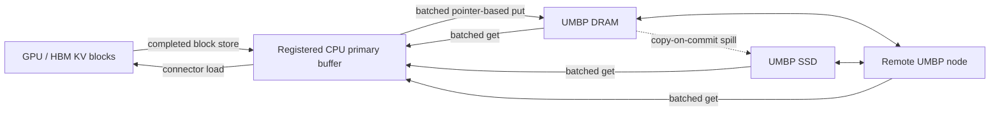
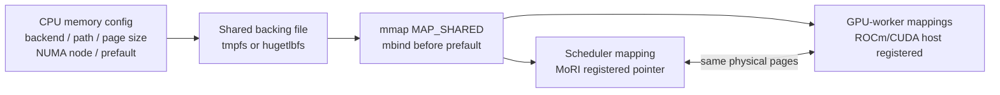
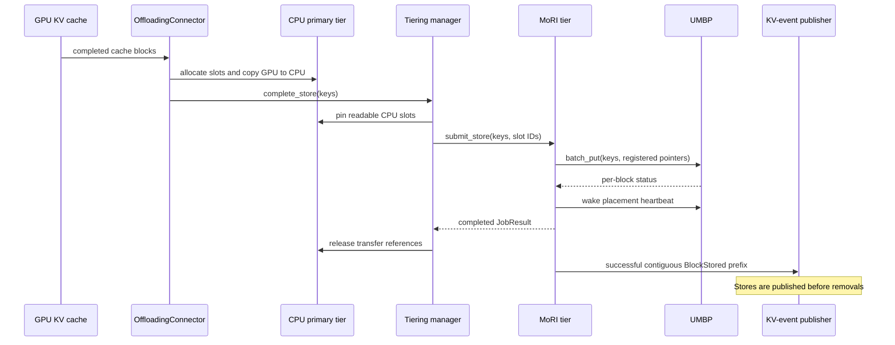
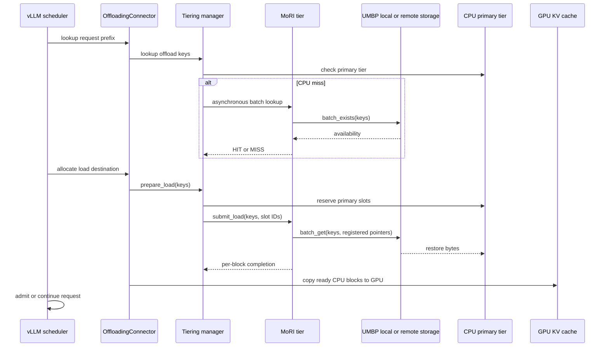
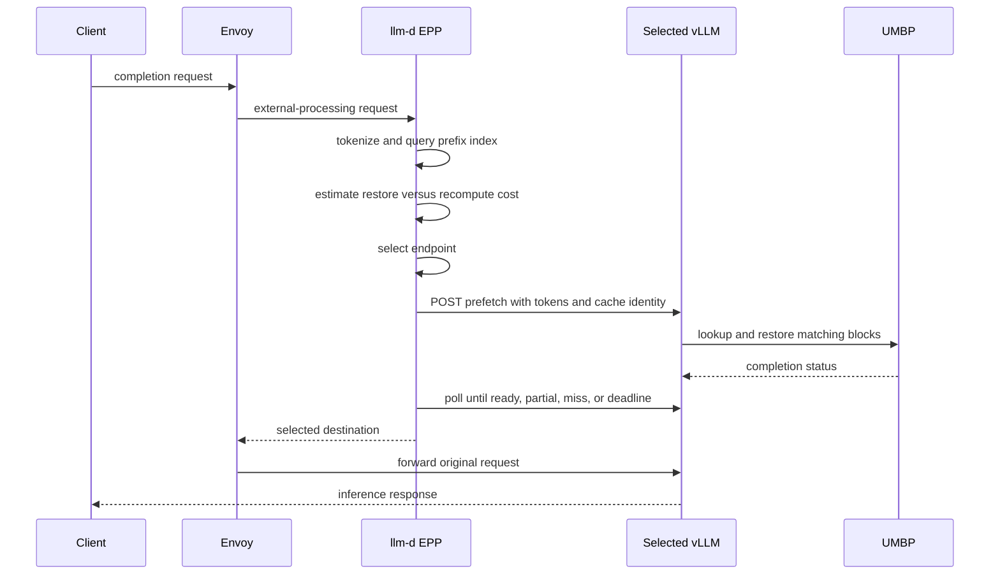

# MoRI UMBP architecture in vLLM

This document describes the current MoRI UMBP integration in vLLM. The
integration adds UMBP as a secondary KV-cache tier behind the existing
`OffloadingConnector`; it does not replace vLLM's GPU cache manager, run a
second in-engine request scheduler, or use the separate `MoRIIOConnector`.

UMBP provides a distributed DRAM pool with optional SSD backing. vLLM owns GPU
and CPU KV-cache allocation, block identity, transfer scheduling, and request
admission. MoRI owns UMBP storage, distributed discovery, and remote transfer.
An external router such as llm-d owns cross-replica placement decisions.

## Documented integration revisions

This architecture describes the integration at the following source
revisions:

| Repository | Branch | Revision |
| --- | --- | --- |
| vLLM | `umbp` | `1f440d65d26024857b336ae455c24ba48894add2` (`require lossless hashes for placement`) |
| MoRI | `umbp-physical-placement` | `6bacfcc952a490f8782998a17b2ddf6b4878641d` (`expose read-only physical placement`) |
| llm-d-router | `umbp-prefetch-checkpoint` | `b0201b2c20c45ef57d915f2aea0930984b3c55ae` (`Use native cache replay as UMBP correctness reference`) |

These revisions are local commits and have not all been pushed. The vLLM tip
includes the host-allocator parent commit
`aa57d4a569b6366f71b38d85690d51a254c40f85`.

## RFC-parity status

The zero-copy allocator and authoritative placement slices are implemented.
The remaining work is performance proof and production hardening, not a
missing host-memory or placement primitive.

| Capability | Current state |
| --- | --- |
| Shared zero-copy CPU primary region | Complete. Scheduler and workers map the same pages; MoRI and GPU host registration use that region. |
| Hugepage, NUMA, and prefault controls | Complete. `default`, `shm`, and `hugetlbfs` backends are supported with strict NUMA failure. |
| Side-effect-free physical placement | Complete in the local MoRI commit through `BatchLookupLocations`; it returns every live node/tier/size/peer replica without access or lease mutation. |
| Physical KV-event enrichment | Complete. The bridge emits selected `HBM`/`DRAM`/`SSD`, source node, locality, and optional calibrated bandwidth, with logical `UMBP` fallback. |
| llm-d restore-cost consumption | Complete. The retained llm-d branch indexes physical hints and scores tier, locality, and bandwidth. |
| Cross-node zero-copy correctness | Complete for the 1 MiB deterministic smoke and 36 bounded-workload restores per policy on the two MI355X hosts. |
| Scheduler effectiveness | Demonstrated in three clean-state aware-versus-random pairs. Aware routing selected the physical owner for 100% of requests versus 55.6% random, avoided 1.90 GB of secondary reads, and reduced p50 latency by a median 22.5% across runs. |
| Production readiness | Pending replay/resync, stale/conflicting-placement failure injection, measured cost calibration, SSD pressure hardening, and the model/concurrency/policy sweep. |

## MI355X validation

The paired evaluation used two eight-GPU MI355X hosts, one GPU and one local
NVMe filesystem per replica, and image
`vllm/vllm-openai-rocm:nightly-1dc464d42681d22f38caf1fdc1eb632dc4421c45`.
Each policy ran from a clean UMBP state. The bounded workload used a 2 GiB
UMBP DRAM region, 95%/80% watermarks, a 1 GiB CPU primary, 136 GPU blocks,
12 fixtures, and three local-cache eviction prompts.

| Result | MoRI-aware | Random |
| --- | ---: | ---: |
| Native-prefix-reference output matches | 36/36 | 36/36 |
| Physical-owner route affinity | 100% | 55.6% |
| Restored prompt tokens | 31,296 | 31,296 |
| Secondary-tier read bytes | 0 | 1,902,903,296 |
| Per-run p50 latency change versus random | -1.4%, 25.0%, 22.5% | Baseline |

Correctness uses an immediate native GPU prefix-cache replay as the expected
output. A cold prefill is not a valid exact-text oracle for a cached-prefix
request: on this model, one deterministic prompt changed from `-003` on cold
prefill to `-000` on an immediate local GPU cache hit because the final-token
logits were nearly tied. CPU-only and MoRI-backed restores both reproduced the
native cached result. The evaluator retains the cold output for diagnostics.

A separate pressure test exceeded UMBP DRAM admission and observed a restored
output mismatch. That path remains a production blocker until SSD spill and
burst-admission behavior are isolated with per-medium read telemetry. A 4 GiB
DRAM region also failed RDMA memory registration with `ENOMEM` on this runtime;
2 GiB registration is verified.

## Component architecture

```mermaid
flowchart LR
    Client[Client] --> Envoy[Envoy gateway]

    subgraph Router[llm-d routing and control plane]
        EPP[Endpoint Picker / EPP]
        Tokens[Token producer]
        Index[Precise prefix index]
        Cost[Restore-cost scorer]
        Picker[Max-score picker]
        Prefetch[UMBP prefetch hook]

        EPP --> Tokens --> Index --> Cost --> Picker
        Picker --> Prefetch
    end

    Envoy --> EPP
    EPP -->|selected endpoint| Envoy

    subgraph NodeA[vLLM replica A]
        APIA[OpenAI and KV-prefetch APIs]
        SchedA[EngineCore scheduler]
        GPUA[GPU KV cache]
        ConnA[OffloadingConnector]
        TierA[TieringOffloadingManager]
        CPUA[CPU primary tier]
        MoriA[MoriSecondaryTierManager]
        ClientA[MoRI UMBPClient]
        DRAMA[UMBP DRAM]
        SSDA[UMBP SSD]
        PubA[ZMQ KV-event publisher]
        BridgeA[UMBP event bridge]

        APIA --> SchedA
        SchedA <--> GPUA
        SchedA <--> ConnA
        ConnA <--> TierA
        TierA <--> CPUA
        CPUA <--> MoriA
        MoriA <--> ClientA
        ClientA <--> DRAMA
        DRAMA -. asynchronous spill .-> SSDA
        SchedA --> PubA --> BridgeA
    end

    subgraph NodeB[vLLM replica B]
        APIB[OpenAI and KV-prefetch APIs]
        SchedB[EngineCore scheduler]
        GPUB[GPU KV cache]
        ConnB[OffloadingConnector]
        TierB[TieringOffloadingManager]
        CPUB[CPU primary tier]
        MoriB[MoriSecondaryTierManager]
        ClientB[MoRI UMBPClient]
        DRAMB[UMBP DRAM]
        SSDB[UMBP SSD]
        PubB[ZMQ KV-event publisher]
        BridgeB[UMBP event bridge]

        APIB --> SchedB
        SchedB <--> GPUB
        SchedB <--> ConnB
        ConnB <--> TierB
        TierB <--> CPUB
        CPUB <--> MoriB
        MoriB <--> ClientB
        ClientB <--> DRAMB
        DRAMB -. asynchronous spill .-> SSDB
        SchedB --> PubB --> BridgeB
    end

    Master[UMBP master and placement directory]
    ClientA <--> Master
    ClientB <--> Master
    ClientA <-->|remote UMBP transfer| ClientB

    BridgeA -->|enriched KV events| Index
    BridgeB -->|enriched KV events| Index
    BridgeA -->|GPU and CPU placement reports| Master
    BridgeB -->|GPU and CPU placement reports| Master
    BridgeA -->|read-only physical location lookup| Master
    BridgeB -->|read-only physical location lookup| Master

    Prefetch -. POST and poll /v1/kv_cache/prefetch .-> APIA
    Prefetch -. POST and poll /v1/kv_cache/prefetch .-> APIB
    Envoy -->|inference request| APIA
    Envoy -->|inference request| APIB
```



There are three cooperating paths:

| Path | Purpose | Main owner |
| --- | --- | --- |
| KV data path | Move KV bytes among GPU, CPU, UMBP DRAM, SSD, and remote nodes. | vLLM and MoRI |
| Event path | Publish block lifecycle and scheduler-visible availability. | vLLM, the UMBP bridge, and llm-d |
| Request path | Score replicas, optionally prefetch, and forward inference traffic. | Envoy and llm-d EPP |

## vLLM data path

`TieringOffloadingSpec` creates a CPU primary tier and the configured secondary
tiers. A secondary tier never reads or writes GPU memory directly. Every MoRI
transfer uses the CPU tier as its staging buffer:



The CPU tier is backed by a shared offload region. During initialization,
`MoriSecondaryTierManager` registers that region with `UMBPClient`. Store and
load jobs therefore pass addresses of CPU slots to MoRI instead of copying
through an additional Python buffer.

The host allocator is file-backed because the scheduler and independently
spawned GPU workers must map the same physical bytes. This differs from an
anonymous per-process host allocator while retaining the same important
properties: optional hugetlbfs backing, NUMA policy applied before faults,
startup prefaulting, and GPU host registration.



The logical region exposed to vLLM remains exactly the configured CPU-cache
capacity. A hugetlbfs backing file is rounded up to a whole hugepage, and the
padding is never exposed as KV slots. Explicit NUMA binding fails closed. One
engine has one binding policy, so a two-socket eight-GPU host should normally
run node-local GPU groups/replicas when strict locality is required.

### Store lifecycle



Only blocks reported successful by MoRI become scheduler-visible UMBP stores.
For a partially accepted batch, vLLM publishes the successful contiguous
prefix ending at the first failure. A later successful block cannot form a
reusable prefix if its parent block was not stored.

UMBP admits new puts into DRAM first. SSD is an asynchronous spill tier, not
an alternative admission target for a burst that has already filled DRAM.
`dram_capacity_bytes` and request pacing must therefore cover the expected
write burst even when SSD has free capacity.

### Restore lifecycle



The manager can return `HIT_PENDING` while asynchronous lookup or promotion is
in progress. Work is polled at scheduler boundaries, allowing unrelated model
work to proceed while the tier operation completes.

## Scheduler-aware prefetch

The optional prefetch API starts restoration before the real inference request
is forwarded:

```text
POST   /v1/kv_cache/prefetch
GET    /v1/kv_cache/prefetch/{prefetch_id}
DELETE /v1/kv_cache/prefetch/{prefetch_id}
```

The external router sends token IDs and cache identity, not router-generated
block hashes. vLLM derives the chained block hashes using its own model, cache
salt, LoRA, multimodal, group, and hash configuration. This avoids silent
identity disagreement between the router and engine.

CPU-targeted prefetch restores matching UMBP blocks into the CPU primary tier.
GPU-targeted prefetch uses an internal non-executing scheduler request to load
matching blocks into the ordinary HBM prefix cache. Pending requests, blocks,
GPU bytes, and terminal results are bounded by the prefetch configuration.
The router may fail open and forward normally when prefetch misses, times out,
or returns an admission-limit error.



## Event and placement path

The vLLM scheduler combines native GPU events with connector events from the
CPU and MoRI tiers. It stably orders stores before `BlockRemoved` and
`AllBlocksCleared` events. This ordering prevents a replacement store and an
old-tier removal in the same scheduler step from creating a transient gap in
the external index.

For llm-d integration, the UMBP bridge:

1. Subscribes to the private vLLM ZMQ event endpoint.
2. Reports vLLM-managed GPU and CPU placement to the UMBP master.
3. Uses the final block hash in each successful `STORAGE` chunk to query
   MoRI's side-effect-free `BatchLookupLocations` RPC.
4. Selects a deterministic source by MoRI tier priority, publisher locality,
   and node ID, then annotates `storage_tier`, `source_node`, `locality`, and an
   optional configured bandwidth.
5. Caches the store observation so a later removal can evict the exact indexed
   identity, splitting a combined removal when its chunks had different
   physical sources.
6. Falls back to logical `UMBP` when placement is still absent after a bounded
   heartbeat-aware polling window.
7. Republishes the enriched batch on a separate ZMQ endpoint.

llm-d subscribes to the bridge output, reconstructs consecutive prefixes from
self-describing events, estimates restore cost, and selects a replica. The
bridge has no replay channel, so it must be running before traffic begins.

`BatchLookupLocations` returns all currently live physical replicas without
recording an access, granting a lease, or incrementing RouteGet counters. The
current KV-event schema carries one placement per store event, so the bridge
publishes the best observed source for the destination endpoint rather than
all replicas. This is a point-in-time observation, not a reservation. llm-d's
physical-placement TTL must therefore expire it if no refresh or removal
arrives. Logical `UMBP` fallback still means only that vLLM observed a
successful UMBP store; it must use calibrated logical-tier cost.

The MoRI manager calls `UMBPClient.flush()` before publishing a successful
storage event when KV events are enabled. In distributed mode this wakes the
heartbeat shipper, reducing the normal placement lag from the periodic
heartbeat interval to the bridge's short retry loop.

The engine must run with `VLLM_KV_EVENTS_USE_INT_BLOCK_HASHES=0` for physical
lookup. MoRI stores the complete SHA-256 block hash plus group ID, whereas the
legacy integer event format retains only the low 64 bits and cannot be reversed
into the data key. The bridge detects that incompatible event shape, warns
once, and emits logical `UMBP` placement without issuing a guaranteed-to-miss
physical lookup.

## Configuration shape

The essential vLLM configuration is:

```json
{
  "kv_connector": "OffloadingConnector",
  "kv_role": "kv_both",
  "kv_connector_extra_config": {
    "spec_name": "TieringOffloadingSpec",
    "cpu_bytes_to_use": 1073741824,
    "cpu_memory_backend": "hugetlbfs",
    "cpu_memory_path": "/dev/hugepages",
    "cpu_hugepage_block_size": "2MB",
    "cpu_numa_node": 0,
    "self_describing_kv_events": true,
    "secondary_tiers": [
      {
        "type": "mori",
        "dram_capacity_bytes": 1073741824,
        "ssd_enabled": true,
        "ssd_storage_dir": "/mnt/umbp-ssd0/vllm-node",
        "ssd_capacity_bytes": 8589934592,
        "ssd_backend": "file",
        "master_address": "10.0.0.1:15558",
        "node_id": "vllm-node-0",
        "node_address": "10.0.0.2",
        "io_engine_port": 16000,
        "peer_service_port": 17000,
        "key_prefix": "vllm:model-and-layout:",
        "enable_kv_events": true
      }
    ]
  }
}
```

KV-event publication must also be enabled globally:

```json
{
  "enable_kv_cache_events": true,
  "publisher": "zmq",
  "endpoint": "tcp://*:5557",
  "topic": "kv@replica@model"
}
```

The vLLM engine environment must include:

```bash
export VLLM_KV_EVENTS_USE_INT_BLOCK_HASHES=0
```

`node_id` and `key_prefix` must match the UMBP bridge. Every local vLLM process
needs unique I/O-engine and peer-service ports. For a container deployment,
the SSD filesystem must be mounted into the container and
`ssd_storage_dir` must name the in-container path.

## Source map

| Responsibility | Implementation |
| --- | --- |
| Connector scheduler and event translation | `vllm/distributed/kv_transfer/kv_connector/v1/offloading/scheduler.py` |
| Shared hugepage/NUMA host allocator | `vllm/v1/kv_offload/cpu/memory.py`, `shared_offload_region.py` |
| Tier construction and registered CPU region | `vllm/v1/kv_offload/tiering/spec.py` |
| Cascade, promotion, completion, and event ordering | `vllm/v1/kv_offload/tiering/manager.py` |
| MoRI UMBP lookup, put, get, and event generation | `vllm/v1/kv_offload/tiering/mori/manager.py` |
| UMBP placement keys and event enrichment | `vllm/v1/kv_offload/tiering/mori/placement.py` |
| Prefetch lifecycle and capacity limits | `vllm/v1/kv_offload/prefetch.py` |
| Prefetch HTTP API | `vllm/entrypoints/serve/kv_cache/api_router.py` |
| Scheduler publication ordering | `vllm/v1/core/sched/scheduler.py` |
| UMBP event bridge | `examples/features/kv_events/umbp_kv_event_bridge.py` |
| Development-only cache-aware proxy | `examples/online_serving/umbp_cache_aware_proxy.py` |

## Current boundaries

- GPU-to-UMBP and UMBP-to-GPU transfers are always staged through the CPU
  primary tier.
- The production cross-replica scheduler belongs in llm-d. The vLLM reference
  proxy is a development and validation tool, not a second production router.
- Physical event hints are point-in-time observations and select one best
  source from the all-replica response; they do not reserve a route.
- Logical UMBP fallback proves addressability, not a physical DRAM/SSD source.
- The live ZMQ bridge does not replay events that were published before it
  subscribed.
- File-backed SSD works on a mounted filesystem. SPDK is a separate MoRI build
  and host-configuration choice.
- MoRI DRAM burst capacity can reject puts before asynchronous SSD spill frees
  space; SSD free space alone does not guarantee admission.
- `MoRIIOConnector` serves prefill/decode KV transfer and is independent of the
  UMBP secondary-tier integration described here.

For operator configuration and validation commands, see
[KV offloading usage](../features/kv_offloading_usage.md). For implementation
status and remaining work, see
[UMBP and llm-d implementation plan](umbp_llmd_implementation_plan.md).
