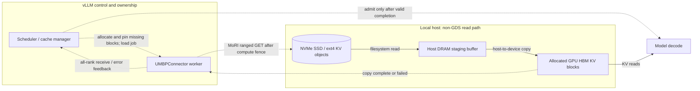
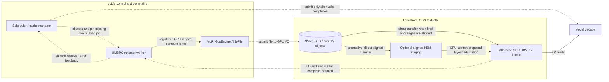

# [RFC]: UMBP KVConnector for P/D Disaggregation and Multi-Tier KV Offloading

Draft for the [vLLM RFC issue form](https://github.com/vllm-project/vllm/blob/main/.github/ISSUE_TEMPLATE/750-RFC.yml).
Not submitted to GitHub.
Implementation status and evidence are dated 2026-09-14.

## Motivation

Propose an optional **UMBPConnector** backed by MoRI's Unified Memory &
Bandwidth Pool (UMBP), using vLLM's existing KVConnector scheduler/worker
interfaces for both KV offloading and prefill/decode (P/D) disaggregation.
The data path must work independently of llm-d or mori-sched; placement-aware
routing and bounded prefetch are optional integration layers. This is a design
proposal with CPU lifecycle tests, native buffer validation and limited Qwen
offload and P/D smokes. A two-host retry passed DRAM and SSD cold/partial-prefix
cases, with independent evidence/source verification and cleanup audits.
This does not establish complete multi-node acceptance,
production readiness, model accuracy or improved performance.

This is a detailed design follow-up to the existing
[MoRI UMBP feature request #48191](https://github.com/vllm-project/vllm/issues/48191).
Coordinate with that issue's participants before posting a separate RFC;
attaching this proposal there is also an option.

Long-context and agentic workloads repeatedly revisit prefixes after their KV
has left GPU memory. Disaggregated serving introduces a related problem: a
prefill engine produces KV that a separate decode engine needs, potentially
with part of that prefix already resident on the decoder. We want one
connector-owned data path that can handle both situations while preserving
vLLM's cache ownership and failure-recovery rules.

vLLM already has P/D and offloading connectors. This proposal adds a MoRI UMBP
backend and its associated control-plane integration; it does not propose
replacing the KVConnector framework or treating existing connectors as incapable
of these workloads. In particular, the existing
[MoRIIOConnector](https://github.com/vllm-project/vllm/blob/1678b396270406c27fcab8f5b86b21fd305ac605/docs/features/moriio_connector_usage.md)
provides a direct P/D transfer path. A reusable, tiered UMBP object pool is a
different storage and lifetime model.

The intended benefits are:

- Restore evicted KV from local or remote DRAM/SSD when cheaper than recompute.
- Deliver prefill KV through the same pool, loading only the decoder's missing
  compatible state rather than retransferring its valid local prefix.
- Expose reliable placement and transfer-cost signals to a router without
  making a router's cache prediction authoritative for engine correctness.
- Support proactive prefetch using connector-managed transfers and ordinary
  cache-manager ownership, without a separate UMBP-only engine execution path.

This is motivated in part by
[SGLang RFC #27898](https://github.com/sgl-project/sglang/issues/27898), which
discusses UMBP-backed storage with scheduler-visible placement and policy. This
RFC adapts those goals to vLLM's scheduler/worker KVConnector contract; SGLang
benchmark or implementation claims are not evidence for this implementation.

## Proposed Change

### Reviewer summary

- **Decision requested:** agree on how to integrate a MoRI UMBP backend into
  vLLM's existing KVConnector framework for both offloading and P/D. Whether
  this is a dedicated connector or a shared offload backend with a thin P/D
  adapter remains open for maintainer feedback.
- **Data path:** store compatible KV in local/remote DRAM or SSD, preserve a
  decoder's valid local prefix, and receive only its missing state. P/D handles
  identify an export; readiness is published only after successful all-rank
  stores. Blocks remain owned until transfers and error handling finish.
- **Optional extensions:** placement-aware llm-d/mori-sched routing, bounded
  prefetch, and eligible direct SSD-to-HBM reads. None is required for the basic
  offload/P-D contract, and none is claimed validated by the current prototype.
- **Evidence boundary:** checkpoint `408c3b752` has 225 passing CPU tests. Its
  independently verified two-host Qwen TP1 smoke matched baseline tokens for
  DRAM and SSD cold/partial P/D. Cold decode
  restores 576 external tokens; partial decode retains 256 local tokens and
  restores 320. Earlier native buffer and single-engine offload smokes passed.
  The previous SSD partial failure remains archived, and a separate native
  byte-accounting gate remains failed: fewer GET objects is not proof of fewer
  network bytes. Exact-current-source native vLLM binaries, full multi-node/TP
  acceptance, eviction pressure, hybrid models and matched model
  accuracy/performance remain gates.

### 1. Add an optional UMBPConnector

Implement a `KVConnectorBase_V1` connector supporting both:

1. **KV offloading:** a serving engine stores reusable KV and restores it after
   local eviction, using embedded storage or a master-led distributed pool.
2. **P/D disaggregation:** a prefill engine hands off computed KV to a separate
   decode engine through that pool, with explicit readiness and failure handling.

The first functional milestone must demonstrate both paths. Passing storage
unit tests or showing prefix reuse between ordinary serving replicas is not
sufficient to claim P/D support.

MoRI is imported only when this connector is selected. Ordinary vLLM serving
must not need MoRI, a UMBP master, llm-d or mori-sched. The initial dependency
target is [MoRI v1.2.3.post1](https://github.com/ROCm/mori/releases/tag/v1.2.3.post1),
commit `67632e80e2e492184b589904b63225f82d45537c`.

The prototype may use `kv_connector_module_path` while interfaces are reviewed.
Register an in-tree connector only with implemented scheduler/worker hooks,
supported-configuration checks, and reproducible serving validation.

### 2. Keep responsibilities explicit

```text
                    Request routing / optional llm-d policy
                         |                    |
                     prefill               decode
                         v                    v
                 +----------------+   +----------------+
                 | vLLM scheduler |   | vLLM scheduler |
                 | + UMBPConnector|   | + UMBPConnector|
                 | block ownership|   | local-prefix  |
                 | handoff state  |   | + missing KV  |
                 +--------+-------+   +--------+-------+
                          | metadata / rank receipts |
                 +--------v-------+   +--------v-------+
                 | worker: fences |   | worker: fences |
                 | registered KV  |   | registered KV  |
                 +--------+-------+   +--------+-------+
                          | ranged PUT         | ranged GET
                          +----------+---------+
                                     v
                           MoRI UMBP object pool
                    local / remote DRAM and file-backed SSD
                                     |
                      placement / capacity / transfer signals
                                     v
                           optional routing policy

 Single-engine offloading uses the same scheduler/worker/pool interfaces.
 Engine HBM placement hints are separate from readable pool objects.
```

This diagram describes the proposal, not a completed deployment.

| Component | Owns |
| --- | --- |
| vLLM cache manager and scheduler | GPU block allocation, valid prefix/checkpoint state, model admission and recomputation |
| Connector scheduler | Lookup, pinned transfer jobs, per-request handoff, all-rank completion and publication decisions |
| Connector worker | Allocation registration, byte layout, compute/transfer fences, native I/O and final outcomes |
| MoRI UMBP | Object storage, pool placement, transport and configured storage/eviction policy |
| llm-d or another router | Replica selection and bounded prefetch coordination; not GPU cache ownership |

MoRI storage policy, vLLM token scheduling, and router request scheduling are
different responsibilities. Neither llm-d nor mori-sched is a prerequisite for
basic connector correctness. A MoRI-aware routing adapter is a separately
validated part of the full integration.

### 3. Define compatible, versioned storage identities

Use vLLM-owned block hashes rather than hashes reconstructed independently from
prompt text by a router. Namespacing must include deployment isolation, model
and immutable weight revision, cache format/encoding, layer/group identity,
parallel shard mapping and hash algorithm. Salt, adapter and multimodal identity
must retain the semantics of vLLM's cache keys.

The initial payload is one logical cache-group block per worker shard, assembled
from its layer buffers using MoRI's ranged API. Its canonical byte order is
sorted layer name followed by logical H/N/C order. Cache capacity, GPU addresses,
physical layer packing and kernel-block splitting are not semantic identity.
The initial format requires matching TP/PP/CP topology; heterogeneous-TP
resharding needs a separately versioned and tested mapping.

Exchange worker-derived layout identities before lookup. A representative
scheduler cache spec is insufficient when workers retain different per-layer
specs. Quantization scale/calibration compatibility must also be established;
otherwise reject reuse even if the apparent tensor shapes match.

For hybrid models, use validated group-specific prefix records and recurrent
checkpoint boundaries. Do not save a mutable recurrent state under a positional
prefix hash merely because it occupies that request's current block-table slot.
Non-prefix-cacheable state needs a request-scoped handoff identity, not a reusable
prefix key. Unsupported required groups must fail configuration or trigger an
explicit supported recomputation path, never disappear from the hit calculation.

### 4. Compose offload with the scheduler lifecycle

Use existing connector hooks for lookup, post-allocation state, scheduler
metadata, worker registration, load/store execution, worker feedback and request
completion. Shared framework changes, if required, should be connector-neutral
and reviewed independently.

The proposed flow is:

1. Look up only the state beyond the request's valid local prefix. Check every
   required cache group and shard, respecting sliding-window and recurrent-state
   semantics. Keep lookup asynchronous and bounded; storage I/O must not block
   the scheduler's execution loop.
2. Allocate destinations through the cache manager. Pin the exact source or
   destination blocks for each generation-scoped transfer job before submission.
3. Workers wait for prior compute/transfer use of those bytes, then issue ranged
   I/O. Metadata does not contain arbitrary caller-supplied memory pointers.
4. Collect final per-object receipts from every required worker. Duplicate
   feedback cannot count as another rank. A failure on one rank does not permit
   freeing blocks that another rank may still be accessing.
5. Publish successful loads through vLLM's cache manager. Report failed receive
   requests and affected block IDs through the connector failure APIs so the
   configured recompute/fail policy can run without consuming unwritten KV.
   Keep receive destinations pinned until every rank's completion/error snapshot
   has been consumed; native completion alone must not allow failed block IDs
   to be reused before the scheduler processes their errors.

Best-effort offload failure is a future miss, not a mandatory-delivery failure.
P/D handoff has stronger completion requirements and must be represented as such.
Finite lookup/admission deadlines must not be confused with safe cancellation
of a running memory operation.

### 5. Make P/D readiness and incremental loading explicit

The proposed handoff carries a versioned handle identifying the model/cache
namespace, producer generation, required token boundary, cache groups and shards.
Sending that handle to the decoder is **not** a claim that the KV is ready.

#### Combined P/D architecture: GDS and non-GDS

This view combines producer export, object placement and decoder receive in
one architecture. Solid arrows carry KV payloads; dashed arrows carry requests,
control or completion. The SSD placements and receive routes are alternatives,
not mandatory duplicate writes or reads. Native GDS remains to be validated.

```mermaid
flowchart LR
    R["Router / optional llm-d"]
    READY["UMBP per-rank ready markers"]

    subgraph P["Prefill host"]
        PC["Prefill scheduler + UMBPConnector"]
        PH["Prefill GPU HBM: computed KV"]
        PUT["MoRI PUT / placement: ordinary write path"]
        PC -.->|"compute; pin export sources"| PH
        PH -->|"after compute fence"| PUT
        PUT -.->|"all-rank export outcomes"| PC
    end

    subgraph D["Decode host"]
        DC["Decode scheduler + UMBPConnector"]
        DS[("Decoder-local UMBP SSD")]
        DR["Host DRAM staging"]
        DH["GPU HBM: valid local prefix + missing KV destinations"]
        RUN["Decode computation"]
        DS -->|"GDS: hipFile direct read"| DH
        DS -->|"non-GDS: filesystem read"| DR
        DR -->|"host-to-device copy"| DH
        DH -.->|"per-rank receive outcomes"| DC
        DC -.->|"admit only after all required receives succeed"| RUN
        DH -->|"KV reads"| RUN
    end

    subgraph O["Other SSD placement: prefill host or another peer"]
        OS[("Remote UMBP SSD")]
        ORAM["Peer host DRAM staging"]
        OS -->|"filesystem read"| ORAM
    end
    NET["Network transport + any destination staging"]

    R -.->|"prefill request"| PC
    PC -.->|"first token + handle; not readiness"| R
    R -.->|"prompt + first token + unchanged handle"| DC
    PUT -->|"placement A: network + ordinary SSD write"| DS
    PUT -->|"placement B: local or remote ordinary SSD write"| OS
    PC -.->|"publish only after successful all-rank export"| READY
    READY -.->|"marker plus missing-object visibility gates GET"| DC
    DC -.->|"GET only missing KV after readiness"| DS
    DC -.->|"remote GET only after readiness"| OS
    ORAM --> NET
    NET --> DH
```



P/D determines which engine produces and consumes KV; GDS determines how an
eligible **decoder-local SSD read** reaches HBM. Placement A makes that local
GDS read possible, but the preceding producer-to-decoder SSD write still uses
the ordinary export/network path. Placement B needs network delivery and is not
a direct local-file GDS read from the remote SSD into decoder HBM. Only absent
prefix blocks are transferred; valid decoder-local KV stays in place.

The GDS arrow assumes suitably aligned final KV destinations. The optional
aligned-HBM-staging/GPU-scatter adaptation is shown in section 6. If readiness
times out, no GET is submitted; if any required receive fails, decode remains
gated and the configured recompute/fail policy applies. Ready markers do not
lease the data against eviction. The existing P/D lifetime rules apply equally
to both data paths.

#### Handoff and receive ordering

```mermaid
sequenceDiagram
    participant R as Router / optional llm-d
    participant P as Prefill engine + connector
    participant U as MoRI UMBP pool / peers
    participant D as Decode engine + connector
    participant S as Decoder-local UMBP SSD
    participant B as Decoder host DRAM staging
    participant H as Decoder GPU HBM

    R->>P: Prefill prompt
    P->>P: Compute KV and retain source blocks
    P-->>R: First sampled token + handoff handle (not readiness)
    R->>D: Prompt + first token + unchanged handle
    par Producer export
        P->>U: Fenced KV PUTs on all required ranks
        U-->>P: Final per-object outcomes from every rank
        alt All exports succeeded and handle unexpired
            P->>U: Publish per-rank ready markers
            U-->>P: Marker publication outcomes
        else Failed or expired export
            P->>P: Authorize release without readiness
        end
        P->>P: Finalize export and release held source blocks
    and Consumer preparation
        D->>D: Validate handle and find valid local prefix
        D->>H: Allocate and pin only missing KV destinations
        D->>U: Wait for rank marker and missing-object visibility
    end
    alt Readiness observed before deadline
        Note over U,H: Alternatives depend on object placement; only missing KV is loaded
        alt Object on decoder-local SSD; GDS fastpath available
            D->>S: MoRI GdsEngine / hipFile read
            S->>H: Direct SSD-to-HBM transfer
            Note over D,H: Optional aligned HBM staging + GPU scatter if required
        else Object on decoder-local SSD; non-GDS or allowed fallback
            D->>S: Host-staged SSD read
            S->>B: SSD bytes into host staging
            B->>H: Host-to-device copy
        else Object on another host's SSD
            D->>U: Remote missing-KV GET
            U->>U: Read SSD into peer-side host staging
            U->>H: Network transfer; destination staging depends on transport
            Note over U,H: Not a direct local-file GDS read across hosts
        end
        H-->>D: Per-rank transfer and GPU-scatter outcomes
        alt Every required receive succeeded
            D->>D: Publish loaded KV and admit decode
        else Missing data or failed read
            D->>D: Invalidate failed receive; recompute or fail by policy
        end
    else Readiness timeout
        D->>D: No KV GET; retire receive and recompute or fail by policy
    end
```

This sequence shows the successful producer export and alternative SSD receive
paths. Failed exports do not publish readiness; allocated consumers time out
and follow the receive-error policy. Each worker gates its GET on its own ready
marker and visibility of every requested missing object, while decode
computation waits for all required receives. A local marker can precede
heartbeat publication of peer-held KV routes; it is not a visibility barrier
for the other objects. A later eviction can still make GET fail. GDS is a
proposed native read-path option, not a new P/D protocol or a validated deployment.
The decoder-local SSD branch requires the object to have been placed there by
an ordinary PUT or an explicit placement/copy operation; the handoff itself
does not automatically copy producer-local SSD contents to the decoder's SSD.

The ready record's storage, lifetime and cleanup are part of the protocol, not
implicit consequences of the last rank submitting a PUT. UMBP's per-object write
completion is not an atomic transaction across all ranks/groups. Reusable prefix
objects may be shared; request-specific boundary state and readiness records
remain generation scoped.

Readiness describes completed production, not a guarantee against later
eviction or peer loss. Reads still validate outcomes. On stale handles,
incompatibility, timeout or missing data, discard the unusable state and follow
the configured recompute/error policy. Exact retention/lease behavior is an open
design question; do not assume an unverified native lease API.

In the current draft implementation, readiness is an immutable, per-rank pool
object keyed by the complete versioned handle. Publication is admitted only
after the producer's all-rank data-store outcome succeeds. The pinned
[Python client bindings](https://github.com/ROCm/mori/blob/67632e80e2e492184b589904b63225f82d45537c/src/pybind/pybind_umbp.cpp)
expose neither per-key deletion nor an object TTL. Handle expiry therefore
limits acceptance, not physical record retention. Normal pool eviction may
reclaim records; bounded metadata growth, retention under pressure and native
teardown still require validation. Never use shared-pool `clear()` for
per-request cleanup. Wall-clock expiry also requires a documented clock-skew
assumption; a local receive deadline does not cancel a running KV memory access.

Validation must measure the decoder's actual missing-state transfers and
recomputed tokens, including the final-logit token, rather than equating a pool
lookup hit with saved prefill work.

### 6. Adapt configuration to the pinned MoRI API

Expose explicit operator settings for namespace/model identity, serving role,
offload/P-D policy, bounded lookup/transfer admission, per-rank storage budgets,
master/peer addresses, native policy, and scratch arena sizes. Exact option
names are subject to review; this RFC does not provide a runnable configuration
for the unfinished connector.

The pinned native
[ranged interface and bindings](https://github.com/ROCm/mori/blob/67632e80e2e492184b589904b63225f82d45537c/src/pybind/pybind_umbp.cpp)
provide per-key outcomes and CPU/GPU registration. Writes must cover a complete
object; reads may request ranges. Register the allocation once, including the
GPU ordinal. Shutdown drains operations and deregisters allocations, without
clearing another engine's shared objects. The Python binding lacks `close()`;
the wrapper must own the native handle and verify its destruction behavior.

In the pinned
[configuration contract](https://github.com/ROCm/mori/blob/67632e80e2e492184b589904b63225f82d45537c/src/umbp/include/umbp/common/config.h),
remote ranged scratch defaults to zero. Size both GET/PUT arenas explicitly.
The legacy distributed `medium` selects one medium; peer-local DRAM/SSD tiering
requires an explicit backend policy. Enabling both capacities is not proof of
promotion/demotion. Distinguish a heterogeneous pool from a tiered local peer.

Bound native GET/PUT batches by staging capacity as well as request count.
The prototype requires each object to fit one page, and splits data calls at
whole-object boundaries using `ssd_staging_slots` as the maximum object count.
One future and allocation lifetime cover all chunks; partial completion must
not publish a successful load early. Clients that can read remote SSD peers
currently need a common batch bound no larger than the smallest peer arena.
Capacity negotiation and fair progress under concurrent staging pressure remain
open work. Read-lease expiry can stall subsequent chunks; do not shorten a
lease without proving that it cannot reclaim bytes still used by a transfer.

Start native validation with DRAM and file-backed ext4 SSD. Keep each worker's
writable state isolated. This proposal does not require SPDK or authorize
filesystem provisioning or kernel changes. Direct-to-HBM support has additional
platform prerequisites, which must be checked separately. Transport details
such as SDMA, RDMA, staging or zero-copy must be observed, not inferred from the
connector name.

#### Direct SSD-to-HBM KV loads through the connector

Include an opt-in direct storage-to-GPU load path in the implementation and
validation plan. KVConnector owns lookup, destination allocation, transfer
lifetime and completion; it does not require payloads to pass through a CPU
buffer. On AMD GPUs, the relevant backend is hipFile / Infinity Storage rather
than NVIDIA's cuFile. The following diagrams compare local SSD restore paths.
Solid arrows carry KV payloads; dashed arrows carry control or completion.
They describe the intended native architecture, not measured transport results.

##### Non-GDS: SSD through host staging to HBM



Host staging is a transfer buffer, not necessarily a retained DRAM cache tier.
The exact copy engine must be verified; this diagram does not assume SDMA.

##### GDS: SSD directly to HBM, without host payload staging



The two solid routes in the GDS diagram are alternatives, not duplicate reads.
CPU software still submits and coordinates I/O; bypassing host payload staging
does not mean GPU-initiated I/O or zero CPU involvement. If host fallback occurs,
the data path is the non-GDS diagram and must be reported as such. P/D uses the
same receive alternatives after the readiness barrier shown in section 5.

The pinned MoRI release already contains a
[GdsEngine](https://github.com/ROCm/mori/blob/67632e80e2e492184b589904b63225f82d45537c/src/umbp/include/umbp/distributed/transfer/gds_engine.h)
and a [local ranged file-read path](https://github.com/ROCm/mori/blob/67632e80e2e492184b589904b63225f82d45537c/src/umbp/distributed/pool_client.cpp).
SSD file references can bypass MoRI's host staging when GDS support is built,
`libhipfile` is available, and `UMBP_ENABLE_GDS=1` enables the backend path.
This is existing native source support, **not validated direct I/O from this
vLLM connector**. The engine implements file-to-GPU reads, not the reverse
GPU-to-file write path. A local file reference also does not provide direct
access to another host's SSD; cross-node delivery still needs an independently
validated transport path.

The implementation must address:

- **Platform and filesystem capability:** check the installed hipFile/HIP,
  driver/kernel and PCIe topology. Existing ext4 storage is a candidate, not
  proof of compatibility. Record the exact supported runtime and mount options;
  do not assume the existing hosts can use the fast path without system changes.
- **Alignment and layout:** satisfy direct-I/O alignment for file offsets,
  GPU destinations and lengths. Per-layer KV ranges may be unaligned even when
  their containing SSD record is aligned. Use aligned/coalesced transfers where
  possible; otherwise evaluate bounded, aligned HBM staging followed by a GPU
  scatter into the paged cache. Account for that extra GPU copy explicitly.
- **Lifetime and failure handling:** register the correct GPU allocation/device,
  retain cache blocks and any staging buffers until I/O and GPU scatter finish,
  and publish only after all required ranks succeed. Short reads, cancellation
  and corrupted data must follow the existing receive-error/recompute contract.
- **Observable fallback:** distinguish direct-to-final-KV, direct-to-HBM-staging
  and host-staged transfers. Provide explicit automatic-fallback versus
  fastpath-required behavior; these are proposed policy semantics, not current
  connector option names. A required-path validation must fail when fallback
  occurs rather than report success as GDS.

hipFile can use a host-buffer compatibility path, and unaligned ranges may
select it. Consequently, neither calling hipFile nor enabling the environment
flag establishes direct storage-to-HBM transfer. Capture backend/fastpath
evidence and fallback counts or bytes, and compare against an intentionally
host-staged baseline. Follow the requirements of the installed release; the
[AMD fastpath documentation](https://rocm.docs.amd.com/projects/hipFile/en/docs-10.0.0/reference/hipFile-io-backends.html)
describes filesystem, runtime and alignment checks and the fallback distinction.
No current CPU-test result establishes this path on the target MI355X systems.

### 7. Add placement-aware routing and bounded prefetch

The full integration also includes an optional placement/event adapter and
llm-d policy integration. Routing may combine validated placement, replica load,
capacity and measured transfer/recompute costs. External engine-HBM reports are
advisory; they do not make a pool object readable.

Define prefetch start/status/cancel semantics using engine-validated token/cache
identity, a bounded byte/job budget, expiry and idempotency. CPU promotion and
HBM preload are distinct operations. HBM preload must use ordinary connector
allocation/load/publication rules while executing no model forward or sampling.
Expiry suppresses publication but does not release memory while I/O is running.

Use or extend an agreed connector-neutral control/hint mechanism. Do not add a
parallel family of UMBP-only core RPCs. Stale events, replay gaps, restarts and
control-plane failure must fall back to ordinary request routing safely.
Integrate traffic priority/admission so background offload or speculative
prefetch cannot consume every resource needed for demand reads and P/D.

### 8. Correctness, effectiveness and rollout gates

| Gate | Required evidence |
| --- | --- |
| Optional dependency and opt-out | Import/serve without MoRI; unchanged no-connector behavior |
| Storage/lifetime contracts | Real buffers; invalid ranges, partial I/O, queue limits, fences, cancellation, drain and owner release |
| Composed scheduler lifecycle | Actual scheduler/block pool; pressure, preemption, same-ID reuse, delayed ranks and failed load recovery |
| Native single-node offload | Forced GPU eviction with verified DRAM and ext4 SSD restore sources |
| Direct SSD-to-HBM loads | Verified hipFile fastpath versus host-staged fallback; aligned/ranged KV correctness, lifetime and corruption tests; actual transfer bytes and matched latency/throughput |
| Native multi-node offload | Remote DRAM/SSD reads, peer/master faults and safe recovery |
| True P/D | Separate prefill/decode engines, all-rank readiness, nonzero local-prefix reuse and missing-state-only reads |
| TP/hybrid state | Full attention, MLA and recurrent groups; boundary validity, group failures and exact supported shard mappings |
| Model correctness | Qwen3-0.6B development tests, matched GSM8K baseline/offload/P-D; Kimi K3 TP8 hybrid and long-context acceptance |
| Routing/prefetch | llm-d adapter, placement staleness/replay recovery, cancellation/expiry, no-model HBM preload and routing opt-out |
| Performance | Matched repeated trials with TTFT, ITL, throughput, tail latency, recomputed tokens and actual transfer bytes |
| Reproduction | Repository/runtime/model pins, commands, workload, logs, failure evidence and cleanup audits |

Compare no connector/recompute, native CPU offload, UMBP tiers and direct P/D
where supported. Report both improvements and regressions across cold, warm,
partially reusable and pressure-heavy workloads. Separate lookup, queueing,
storage/transport and GPU materialization costs. Count actual I/O: a successful
deduplicated PUT is not evidence that its logical bytes crossed a NIC or SSD.
Do not claim a universal speedup or merge readiness from smoke tests.

Proposed implementation sequence:

1. Storage, identities, layout mapping and transfer-lifetime contracts.
2. Native configuration plus scheduler/worker hooks, followed by composed
   offload and P/D handoff tests. Both paths gate the functional milestone.
3. Native GPU/DRAM/SSD and two-node model correctness, including hybrid state;
   validate direct SSD-to-HBM loads separately against host-staged fallback.
4. Placement-aware routing, connector-controlled prefetch and fault recovery.
5. Matched accuracy/performance evaluation and publication of reproduction data.

### 9. Alternatives and trade-offs

- **MoRIIO P/D plus a separate offloader:** retains a direct transfer path and
  may win for cold handoffs, but requires coordination of two data paths and
  ownership models. Benchmark it; the shared pool is not assumed faster.
- **UMBP only as an offloading backend:** useful, but does not by itself define
  P/D readiness, incremental decoder loading or request-specific boundary state.
- **Reuse general offloading components:** preferred where contracts match;
  factor common ownership/layout logic instead of maintaining another generic
  cache manager. Whether the upstream form is a dedicated connector or a shared
  backend with a thin P/D adapter is a maintainer-facing design decision.
- **Pool-mediated P/D:** enables reuse and decouples engines, at the cost of
  storage admission, metadata, staging and potentially extra copies. Bounded
  memory and metadata pressure must be measured under real serving concurrency.

### 10. Questions for maintainers

1. Should this upstream as a dedicated UMBPConnector, or reuse the offloading
   connector with a common storage interface and a thin P/D handoff layer?
2. Which existing scheduler ownership/prefix-record abstractions should be used
   for all-group save sources and generation-scoped completion?
3. What is the preferred connector-neutral readiness/control/hint surface for
   router-driven prefetch and a P/D handle whose data is not ready yet?
4. Should the initial wire format require identical topology, or is portable
   heterogeneous-TP sharding required for the first upstream feature milestone?
5. What retention guarantee should pool-mediated P/D promise, and what should
   happen when a ready object's storage lease cannot be maintained?
6. What native CI coverage and ongoing ROCm ownership are required before in-tree
   registration? Which shared changes should be reviewed separately?

## Feedback Period

At least two weeks after posting, with particular attention to KVConnector,
cache-manager/hybrid-state, P/D, ROCm and routing maintainers.

## CC List

To be selected by the submitter. No maintainer handles are added automatically.

## Any Other Things

### Related work and overlap

Coordinate with existing work rather than creating a second general framework:

- [MoRI UMBP feature request #48191](https://github.com/vllm-project/vllm/issues/48191)
  already requests single-node offload, broader model/parallelism support and
  multi-node P/D with DRAM and NVMe. This RFC develops the connector design for
  that request; it does not claim the feature request is new.
- [Multi-tier offloading RFC #38260](https://github.com/vllm-project/vllm/issues/38260)
  discusses reusable multi-tier offloading architecture through a primary CPU
  tier and explicitly excludes direct GPU access by secondary tiers. Reusing
  that interface is a strong option for host-staged UMBP; the proposed optional
  direct SSD-to-HBM path would need a separately agreed extension or adapter.
- [Prefix-record save sources RFC #52837](https://github.com/vllm-project/vllm/issues/52837)
  addresses source identity/ownership for valid cached state.
- [Transfer QoS RFC #46016](https://github.com/vllm-project/vllm/issues/46016)
  discusses prioritizing critical P/D traffic alongside background transfers.
- [KV hint envelope RFC #53421](https://github.com/vllm-project/vllm/issues/53421)
  proposes a versioned orchestrator-neutral hint surface.
- [Generic control RPC discussion #51636](https://github.com/vllm-project/vllm/issues/51636)
  is marked closed as duplicate; it is related discussion, not an accepted API
  that this proposal assumes exists.

The distinct proposal here is a release-pinned UMBP data plane with a concrete
joint offload/P-D lifecycle, plus placement/prefetch adapters. On 2026-09-14,
the public GitHub API confirmed #48191 is open and its only comment is an
automated ROCm CC notice. Open-PR searches for `48191 in:body`, `UMBP`, and
`MoRI offload`, each scoped to `vllm-project/vllm`, returned zero results with
`incomplete_results=false`. These narrow searches are not an exhaustive
duplicate-work determination: overlapping work may use other names. Refresh
issues, PRs and their implementations before submission or opening a PR.

### Current prototype and evidence limits

The local prototype starts from `EmbeddedLLM/vllm:umbpkvconnector` at
`1678b396270406c27fcab8f5b86b21fd305ac605`, with these unpublished checkpoints:

- `d9692bb0f9ec30a72a5307c338c2199f0c4b74cb`: ranged storage and key identities.
- `6b71857f514ac5b5b568c1bfeaca9fa7e7de6f35`: page mapping and fenced transfers.
- `2f891e734513fa26d3c469c62b7dba64b3c2f656`: explicit native storage policy,
  layout-derived sizing checks and private SSD-path lifetime.
- `4ab562728fff64cd2c12de8068f263e938c94c90`: cache-manager-owned transfer jobs,
  rank-local asynchronous lookup, all-rank finalization and receive/error
  snapshot retirement.
- `b4d667df1d2df175ca9892a1971da30423fd9746`: real KVConnector startup and dense
  offload request hooks, model-configuration identity, fresh-worker epoch
  binding, and composed Scheduler tests.
- `5e4e04707979189a3258e5f24213580abd16c901`: dense pool-mediated P/D handoff,
  all-rank readiness and release, missing-prefix receives and failure recovery.
- `ea55a38003e11c26d9d7b4e6c9b646135ba8f231`: opt-in native DRAM/SSD ranged
  buffer tests and native build/reproduction documentation.
- `2dc83e970aa6c2ae0f7df3e3d2456694c7d0cb0f`: bound native GET/PUT batches by
  SSD staging capacity while preserving whole-job ownership and ordered
  outcomes; source checkpoint for the single-engine Qwen evidence below.
- `efac63da24ddba5374d4a55ad30923c400c239a4`: require the ready marker and
  receiver-visible missing objects before a P/D GET; preserve deadlines and
  post-probe eviction handling.
- `408c3b752eaf18dd9c055d9ab5bac3208c5071df`: bounded retries of failed immutable
  PUT objects, shutdown-interruptible retry waits, retained buffer ownership
  and bounded failure diagnostics; permanent failures still withhold readiness.

MoRI remains unchanged at release commit
`67632e80e2e492184b589904b63225f82d45537c`. The preserved llm-d-router reference
is `7541552c71642f2756517a7aeb3c0c35720c06d0`; llm-d is
`d557f83e1e5f1e5a6ed54ef154c554cf6c775e33`. Neither has yet been ported or
validated against this new connector implementation.

CPU evidence at `efac63da2`: **205 passed, eight native cases skipped**
in 18.34 seconds. These cover physical layouts, generation/rank receipts,
policy translation, private-path isolation
and lifetime/failure cases using CPU buffers and a native-API fake. Composed
tests use the real KVCacheManager/BlockPool and both vLLM model-runner output
collectors. Additional single-worker tests now use the actual connector factory
and Scheduler for dense offload: cold save, eviction, missing-prefix-only restore,
chunked prefill, unequal group sizes, lookup gaps, timeout, abort, failed receive
recomputation and inter-engine model-identity isolation. In this CPU suite,
native I/O, GPU events and model execution are still fakes.

The current CPU suite at `408c3b752` has **225 passed, eight native cases
skipped**, in 21.05 seconds. Additional tests cover retrying only failed PUT
objects, a shared operation-wide retry budget, unchanged GET failures,
exceptions/malformed results during retries, shutdown/ownership and withholding
P/D readiness until successful retries complete. Permanent failed exports
remain failures. Applicable source, type-check and commit hooks passed.

The P/D suite includes a two-worker component test proving that a delayed rank
prevents readiness and a failed export selects release. Separate single-worker
producer/consumer Scheduler instances exercise the actual engine-output handle,
byte-checked missing-prefix restoration, partial prompt tails and unequal dense
groups. Additional cases cover invalid/expired handles, eviction after readiness,
configured recompute/fail behavior and aborts while a native existence probe is
blocked. A delayed-visibility regression reproduces an early GET on the former
marker-only gate and passes with the marker-plus-data gate. Ordinary offload
also runs with P/D enabled and disabled. All applicable
code/commit hooks passed. The unrelated actionlint installer was skipped; no
workflow files changed.

The batching regression tests additionally check ordered multi-chunk reads and
writes with a middle missing object, malformed later-chunk results, cancellation
and close during a later chunk, and the configuration-to-native batch bound.

The current connector enables dense P/D roles with explicit shared-master
configuration and exports complete, jointly aligned prefix blocks. Any partial
prompt tail is recomputed on the decoder. It is accessible via the development
module-path mechanism, not the built-in registry. Unsupported hybrid/non-prefix,
parallel/speculative and quantized configurations remain explicitly rejected;
implementing their required semantics remains part of the full proposal.

Separate native validation at `ea55a3800`: **eight tests passed** on one MI355X
GPU, covering CPU/GPU source and destination combinations with DRAM-only and
ext4 SSD-only storage. The tests exercise real registered buffers, reordered
full-object writes, partial reads, untouched destination padding and missing-key
outcomes. MoRI was built from the pinned release source; the tested native
library SHA256 is
`d2c9b02ed7da9a727e43f1f8155b97b7fb7fea71e6fd9ac31e09cc9a47702c60`.
GDS and SPDK were disabled. These are buffer-storage tests, not model-serving,
network-transfer, tier-promotion or in-flight cancellation acceptance.

The latest **Qwen3-0.6B single-engine offload smoke passed** at `2dc83e970`,
using model revision `c1899de289a04d12100db370d81485cdf75e47ca`, TP1, BF16,
eager execution, block size 16, `ROCM_AITER_UNIFIED_ATTN` and LBHNC in all arms.
Each arm used a fresh engine, generated a cold response, reset only the local
prefix cache (`reset_connector=False`), then repeated the same 584-token prompt.
The connector's receive-failure policy was `fail`, so failed GETs could not
silently pass by recomputing.

| Arm | Cold cached tokens | Cached tokens after local reset | Output token IDs match baseline | Repeat request wall time |
| --- | ---: | ---: | --- | ---: |
| No connector | 0 | 0 | Yes, 15 tokens | 0.144 s |
| DRAM-only UMBP | 0 | 576 | Yes, 15 tokens | 0.155 s |
| ext4 SSD-only UMBP | 0 | 576 | Yes, 15 tokens | 6.463 s |

Local prefix-cache hits were zero in every request. An independent verifier
checked all six request receipts against the recovered JSON, token equality,
cache counters, backend/layout selections and completion markers. It also
rejected the preceding failed SSD attempt, where lookup reported 576 tokens but
no successful restore completed.

These are single-request wall times, not isolated storage-read timings or a
benchmark. A local prefix-cache reset does not prove that the old GPU bytes were
overwritten or that the system survives actual eviction pressure. One greedy
prompt is not a model-accuracy evaluation.

The engine experiment used current Python source at `2dc83e970`, but reused
precompiled vLLM extensions from nightly commit
`1dc464d42681d22f38caf1fdc1eb632dc4421c45`, image ID
`sha256:40e19c756e3dc9ffc9117770904d40376c7d3bf529cc76ddc379cde7ac4dae2d`,
with ROCm 7.2.3 and PyTorch `2.12.0+git6bbd260`. Imports were checked against
the task's source and native library. The image extensions were **not rebuilt
from the current vLLM commit**; native sources and dependency requirements
differ, so this is limited runtime-compatibility evidence, not an exact-source
native build validation.

Earlier failures are retained as negative evidence. The first attempt filled a
4 GiB tmpfs while relocating AITER's approximately 4.6 GB installed JIT tree.
The matched retry used SSD-backed task-owned `AITER_JIT_DIR` and temporary
storage, with symlinks to immutable image modules. That fixed startup, but
revealed a real SSD failure: a 36-object GET exceeded 16 staging slots. The
current checkpoint splits that GET into 16/16/4-object calls. The observed
6.46-second SSD repeat is consistent with two turnovers of the pinned backend's
default 3-second read leases; this mechanism is a source-based interpretation,
not a profiled latency attribution. Staging efficiency and pressure remain work
to do, not accepted performance.

All evidence is retained on the controller VPS. Recovery archive SHA256:
`1d957f08a351e61b27ff17037f493df2d405929e1ff1ffeb7bf988d0e6e164e8`.
The controller hash-verified recovery before deleting its task-owned state.
An independent read-only audit confirmed the run root and labelled Docker
objects were absent, GPUs returned to baseline memory, and the pre-existing
image and read-only model snapshot checks were preserved. No new weights were
downloaded. These cleanup checks are operational evidence, not serving gates.

A first native separate-engine P/D attempt at `2dc83e970` failed its cold
receive despite a valid producer handle and a 576-token external-hit counter.
The decoder returned no tokens under the fail policy. Native source inspection
identified the marker/data visibility race described above; the regression and
fix are in `efac63da2`. A separate host-network two-client test verified a
4096-byte native RDMA PUT and consumer-local GET, but that is not model P/D.
Failed attempts, recovered evidence and independent cleanup audits are retained
in the reproduction notes; this RFC does not turn them into serving passes.

The subsequent **same-host, separate-GPU Qwen P/D smoke passed** at `efac63da2`.
An independent verifier checked seven log receipts against recovered JSON,
distinct GPU UUIDs, matching attention/layout and the actual producer handoff.
Both cold and partial-prefix cases reproduced the baseline's 15 token IDs
(one from producer, 14 from decoder). Cold decode restored 576 external tokens;
partial decode kept 256 local tokens and restored only 320 external tokens.
Native GET calls contained 36 and 20 objects respectively. This uses two TP1
`LLM` engines on one host, not multi-node or HTTP/llm-d serving, and tests DRAM
KV storage, not SSD P/D.

Decoder request wall times were 3.064 s and 4.612 s, including readiness waiting;
there is no speedup claim. The additional native byte-accounting check failed:
debug totals omitted bytes from `ServeWholeObjectUnitsFromMedium`, whose
`remote_bytes` parameter is not updated in the pinned release. The raw logs
and failed check are retained. Fewer requested objects does not establish fewer
network bytes, especially because placement differed between cases. That native
path also admits full remote objects into local medium slots regardless of the
ordinary `cache_remote_fetches` switch; capacity/placement accounting must cover
this behavior. These gaps need resolution before performance acceptance.

The P/D recovery archive SHA256 is
`858a2209f741341071aceb6b2dff4a919e3bc9eed461f818bf3db487f5fbfe83`.
Recovery was verified before exact task-state deletion. Independent audit
confirmed no task root/resources/listeners/processes remained and the original
image and pre-existing model checks were preserved. No new weights were downloaded.

The earlier **two-host experiment at `efac63da2` failed its full smoke gate**.
With a TP1 engine on each of two MI355X hosts, DRAM cold and partial P/D matched
the 15-token baseline with external/local counts of 576/0 and 320/256. SSD cold
P/D also matched, restoring 576 tokens. Decoder wall times were 2.864, 3.437 and
7.519 seconds respectively. SSD partial P/D instead returned an error and zero
tokens after 119.798 seconds. Its advertised 320-token external hit was not a
completed receive: no partial GET was issued, and only the cold export logged
a ready-marker PUT. The precise native export failure remains to be isolated;
staging and metadata warnings alone do not establish its root cause.

Both storage arms first verified a forced cross-host 4096-byte native read
into a poisoned destination: the consumer registered only after the producer
PUT completed. Native logs confirm a remote GET, not a consumer-local lookup.
This is transport correctness evidence, not physical-byte accounting or
bandwidth measurement. SSD used the POSIX fallback, not GDS or SPDK. The
unchanged full-arm verifier rejected the failed SSD partial case. A separate
report verified all four case receipts against the recovered artifacts and
explicitly reported incomplete acceptance. Both hosts passed independent
cleanup audits after hash-verified VPS recovery; pre-existing models and Docker
inventories were preserved. No weights were downloaded.

A separate native-only diagnostic on unchanged `efac63da2` reproduced SSD
read-to-write staging pressure. After 16 successful reads consumed the 16-slot
staging arena, a new PUT failed until attempt 63 at 3.112 seconds; the write-only
SSD and DRAM controls passed immediately. Poisoned-buffer verification covered
65,536 read bytes and a final 4096-byte GET. Independent evidence and cleanup
checks passed; no model was mounted or executed. This establishes a transient
native failure mechanism, not retrospective per-object proof of the model
export's cause.

The new `storage.store_retry_timeout_s` defaults to five seconds, shared across
all chunks of an immutable PUT; zero disables retries. Only failed objects are
resubmitted, with bounded backoff. Native exceptions and malformed responses
remain errors. Since the native API returns booleans, it cannot classify a false
result as transient versus permanent: failures still present at budget expiry
remain failed exports. Buffers stay owned through the final native call, and
shutdown wakes retry waits before draining. This does not bound native call
duration, retry GETs, extend handoff expiry or bypass readiness.

The new two-host run at `408c3b752` passed all four model cases against the
unchanged independent full-arm verifier and baseline token oracle, with the same 120-second
handoff deadline and `fail` receive policy. DRAM cold/partial decoder wall
times were 3.223/3.375 seconds; SSD cold/partial were 5.123/2.791 seconds. The
SSD producer logged seven initially failed objects in the chunk starting at
object 16; two selective retry calls completed them, with zero failures left.
This is a correctness smoke exercising the new retry path, not a performance
comparison or proof that all staging-pressure workloads make progress.
The verifier compared every RPC receipt with recovered JSON and checked
handoff, token equality, external/local cache metrics and native GET batches
of 16/16/4 then 16/4 in each medium. A separate recovered-source check verified
all 13 installed UMBP modules against the frozen checkpoint. The read-only
cleanup audit confirmed both hosts' task resources absent and pre-existing
models/Docker inventories preserved after hash-verified VPS recovery. No
weights were downloaded. The earlier failed case is not reclassified by this
new result, and the physical-byte-accounting gate remains unresolved.

Native pressure-tested offload, complete multi-node/TP P/D, hybrid boundaries,
corruption recovery, model accuracy and performance remain unproven. Routing/prefetch and
llm-d integration are not yet ported. Earlier integration results from other
branches or releases are not carried over as validation of this prototype.
The earlier 181-test offload and 184-test uncommitted snapshots remain historical
evidence, not the result attributed to the current code checkpoint.

One native integrity gap needs explicit resolution: the pinned
[SSD ranged-read interface](https://github.com/ROCm/mori/blob/67632e80e2e492184b589904b63225f82d45537c/src/umbp/include/umbp/local/tiers/ssd_tier.h)
does not verify whole-record CRCs on ranged reads. Enabling the native CRC
option alone is therefore insufficient evidence of corruption detection on
this path. The implementation needs an integrity strategy and fault-injection
evidence before claiming that corrupted KV reliably triggers recomputation.

See the adjacent [implementation and reproduction notes](umbp_kvconnector_reimplementation.md)
for commands and detailed acceptance tracking, checkpointed separately at
`4ca532a2b1e08d4d45e3f684d50ca66162bfe4b8`, including the passing two-host
run at source `408c3b752`. Earlier documentation checkpoints
`2d31076aaa83cdc9560065014a552e436091bd5a` and
`e227dbfb6764aa0da819fe5f59926c2d11c409b6` retain the failed two-host and passing
same-host experiments at `efac63da2`. These documentation commits do not alter
the tested code. Public reproduction artifacts must accompany a future PR;
the local commit IDs above are not currently public download links.

### Deployment and privacy

Follow vLLM's [inter-node security guidance](https://github.com/vllm-project/vllm/blob/1678b396270406c27fcab8f5b86b21fd305ac605/docs/usage/security.md).
Keep pool/control endpoints inside the deployment trust boundary. A cache
namespace or content hash is not authentication or encryption. Protect stored
KV as model-derived user data; bound management requests and avoid exposing raw
tokens, pointers, credentials or per-request identifiers in metric labels.
Neither normal shutdown nor a local reset may clear unrelated shared KV.

This RFC and prototype were prepared with AI assistance. Human review of the
proposal, every changed line and model evaluation evidence is required before
submitting an implementation PR.

### Before submitting

- Use the first heading as the issue title and copy the five top-level sections
  into the matching RFC form fields. The proposal is suitable for review as a
  draft, not an assertion that the implementation is ready to merge.
- Replace the relative reproduction-document link with an accessible, immutable
  URL before posting. Do not publish controller logs without reviewing them for
  deployment details or sensitive data.

- [ ] Human author reviews and owns the proposal and recorded evidence.
- [ ] Refresh related issues/PRs and resolve duplicate or overlapping work.
- [ ] Complete the RFC issue form's documentation-chatbot prerequisite; it has
  not been performed by this draft.
- [ ] Select the CC list and confirm the feedback period.
- [ ] Publish any referenced prototype/evidence links intended for reviewers.
- [ ] Obtain explicit approval to post the issue; this file alone posts nothing.
