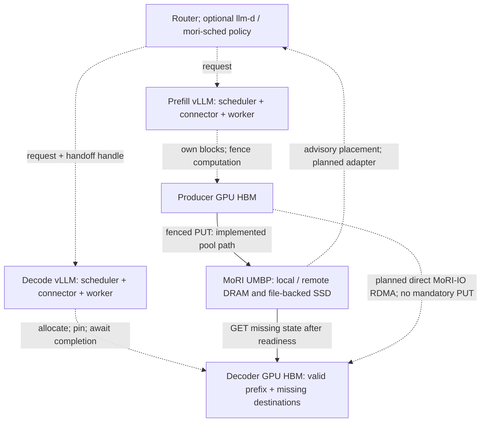

# [RFC]: MoRI UMBP KVConnector for Offloading and P/D Disaggregation

Local issue-body draft; not submitted to GitHub. Status: 2026-09-14.
This is the concise companion to the [detailed design](umbp_kvconnector_rfc.md)
and [reproduction record](umbp_kvconnector_reimplementation.md).
Replace relative links with accessible, immutable URLs before posting.

## Motivation

Long-context and agentic workloads revisit prefixes after their KV has left
GPU memory. Prefill/decode (P/D) disaggregation adds a related requirement:
deliver a producer's KV to a decoder while preserving any valid decoder-local
prefix. We propose an optional MoRI UMBP integration through vLLM's existing
KVConnector interfaces for both workloads.

This develops the existing
[UMBP feature request #48191](https://github.com/vllm-project/vllm/issues/48191),
not a new claim that vLLM needs an offloading framework. Coordinate with that
issue before creating a separate RFC; this proposal can instead be attached
to the existing discussion.

The intended outcome is one explicit ownership and completion contract for
reusable pool-backed KV and fresh P/D delivery. Basic offload and P/D must work
without llm-d or mori-sched. Placement-aware routing and bounded prefetch are
optional, separately validated extensions.

## Proposed Change

### Scope and architecture

Introduce a release-pinned MoRI UMBP backend using scheduler/worker KVConnector
hooks. The upstream packaging is open for discussion: a dedicated connector,
or a shared offloading backend with a thin P/D adapter.

Single-engine offloading uses the same pool interfaces. The direct RDMA arrow
is planned, not an implemented mode. RDMA within a storage pool does not by
itself establish direct producer-HBM-to-decoder-HBM delivery.

The target supports:

- Ordinary offload and restore through embedded storage or a distributed pool.
- Pool-mediated P/D with explicit export readiness and missing-state-only reads.
- Direct MoRI-IO RDMA P/D for eligible producer-resident KV, coordinated with
  pool restore and optional background persistence. Reuse existing MoRIIO
  transport machinery; do not duplicate the RDMA stack.
- Optional placement-aware routing, bounded prefetch and eligible direct
  SSD-to-HBM reads, each behind its own correctness and effectiveness gates.
- Required hybrid memory allocation, ROCm attention-backend coverage, XpYd and
  heterogeneous P/D, explicitly DPEP8 prefill to TP8EP8 decode. These expand
  the implementation target; current matching-TP1 smokes do not establish them.

### Hybrid allocation, backend compatibility and XpYd

Keep vLLM's hybrid KV cache manager enabled for supported mixed full/windowed
attention and recurrent-state models. Respect group-specific logical blocks,
windows/checkpoints, allocator page constraints, padding and shared/CoW views.
Do not replace HMA with dense allocation just to make transfer work. Validate
both cache correctness and HBM efficiency; HMA and UMBP tiering are distinct.

Cover ROCm-eligible attention backends for the pinned model/runtime: dense
Triton/ROCm/AITER, MLA Triton/AITER and sparse MLA where applicable, plus any
additional eligible selector entries. Maintain an explicit capability matrix
and record requested versus actual backends. Support compatible differing P/D
backends through versioned byte-layout/encoding adapters. Existing guards,
including the `ROCM_ATTN` asymmetric-view restriction, stay until validated;
silent fallback is not a passing backend test.

XpYd counts X request-owning prefill engines and Y decode engines, with separate
deployment-group, DP and GPU counts. Require 1p1d, 1p2d, 2p1d and 2p2d, plus:

| Side | Required example, with PP/PCP/DCP=1 | GPUs |
| --- | --- | ---: |
| Prefill DPEP8 | DP=8, TP=1, EP=8; eight request owners | 8 |
| Decode TP8EP8 | DP=1, TP=8, EP=8; one request owner | 8 |

This is 8p1d under the stated logical-engine convention, even if deployed as
one service group per side. EP does not multiply the GPU count again. Each
request's producing DP engine must deliver its KV into the decoder's appropriate
TP shards; other producer DP engines' requests are not pieces of that KV.
Use model-specific split/gather/replication for dense/GQA/MQA, MLA and hybrid
state. Expert ownership is not attention-KV ownership. Negotiate explicit
topology/layout descriptors and exact source/destination completion sets;
removing topology identity checks is not resharding.

Also require **TP8 to 2x TP4 (1p2d)** and **2x TP4 to TP8 (2p1d)**,
each using eight GPUs per side. Two TP4 engines are separate request owners,
not a single TP8 engine; each has DP=1 and PP/PCP/DCP=1, with EP specified
separately. Route each request to one producer and one decoder, assemble
TP8 state into the selected TP4 decoder or split/replicate TP4 state into
TP8 using model-specific mappings. Never combine unrelated producer requests
or implicitly broadcast to both decoders. Exercise both replicas concurrently,
including partial-prefix reuse and failures, in direct/pool/offload modes.
Validate both directions with models that fit TP4 and compare fixed GPU budgets,
resharding cost, capacity, fairness and tail latency.

Validate concurrent routing, fairness, partial reuse, cancellation and failed
or restarted engines for direct and pool paths, including background offload.
Require a combined hybrid-model, differing-backend, heterogeneous-topology test;
isolated feature passes are insufficient. See the
[expanded plan and backend list](umbp_kvconnector_reimplementation.md#hybrid-allocation-rocm-backends-and-heterogeneous-xpyd)
for detailed gates and references to upstream HMA, backend and EP contracts.

### Correctness contract

1. **Compatible identities.** Use vLLM-owned hashes with deployment, immutable
   model revision, cache format, group/layer and shard identity. Workers validate
   byte layouts before reuse. Unsupported topology or state is rejected, not
   silently omitted from hit calculation.
2. **Cache-manager ownership.** Pin exact source/destination blocks before
   transfer. Keep blocks, registrations and staging buffers owned until every
   required rank has finished, including error processing. Expiry is not native
   I/O cancellation.
3. **Fenced publication.** Workers fence compute and transfers. Publish received
   KV only after successful required group/rank outcomes. Duplicate or stale
   receipts cannot release a newer transfer's blocks.
4. **Explicit pool readiness.** A producer handle is not proof of completed
   export. Publish readiness only after successful all-rank stores; consumers
   check readiness and missing-object visibility before GET. Later eviction
   can still fail a read, so GET outcomes remain authoritative.
5. **Safe recovery.** Invalid or failed receives follow vLLM's configured
   recompute/fail policy. Drain native writers before fallback or block reuse.
   Failed best-effort offload becomes a future miss; failed mandatory delivery
   must not be reported as a successful handoff.
6. **Hybrid boundaries.** Save exact validated recurrent checkpoints, not mutable
   block-table positions. Restore a boundary supported by every required group.
   Mandatory P/D checkpoint retention is a separate requirement from ordinary
   best-effort offload.
7. **Coordinated paths.** Direct and pool paths must own disjoint missing ranges
   and produce one admission decision. Optional persistence must not delay or
   fail a completed direct receive, but retains its sources until its own work
   drains. Forced modes precede automatic path selection.
8. **Bounded resources and opt-out.** Bound queues, batches, storage, scratch and
   retries. Keep MoRI optional when the connector is disabled. Never clear other
   engines' shared objects during request cleanup or shutdown.

The initial native dependency is
[MoRI v1.2.3.post1](https://github.com/ROCm/mori/releases/tag/v1.2.3.post1).
Start with DRAM and file-backed ext4 SSD. SPDK and kernel changes are not
required by this proposal. hipFile/GDS is an optional, separately verified
read path; an enable flag alone is not evidence of bypassing host staging.

Router placement is advisory, not authority to read arbitrary memory or admit
decode. Prefetch must use connector-managed allocation and publication with
byte/job limits, expiry and cancellation, without model forward or sampling.
Namespace isolation is not authentication; storage/control endpoints must stay
inside the deployment trust boundary and stored KV must be protected.

### Implementation and evaluation plan

Land reviewable stages, reusing connector-neutral components where appropriate:

1. Storage identities/layouts, native configuration and transfer ownership.
2. Ordinary offload and pool-mediated P/D lifecycle with composed Scheduler tests.
3. Native GPU/DRAM/SSD and two-node validation, including required hybrid and TP
   configurations, failure handling and corruption detection.
   Cover HMA, eligible same/cross-backend layouts and XpYd resharding, including
   DPEP8 to TP8EP8 and the combined configuration acceptance gate.
4. Direct MoRIIO delivery, coordinated pool fallback and background persistence.
5. Optional placement/routing, prefetch and observable GDS support.
6. Matched accuracy and performance evaluation with public reproduction evidence.

Correctness gates include poisoned receive buffers, real eviction pressure,
partial prefixes, delayed/failed ranks, abort/preemption, stale generations,
peer/master failures and corruption. Model evaluation includes matched
Qwen3-0.6B GSM8K baseline/offload/P-D and Kimi K3 TP8 hybrid/long-context tests.
CPU fakes and a single greedy prompt cannot replace these gates.

Measure these three matched P/D cases, plus unchanged MoRIIO and recompute
references:

| Case | Fresh handoff | Persistence |
| --- | --- | --- |
| Direct-only | Direct MoRI-IO RDMA | Disabled |
| Direct-plus-offload | Direct RDMA, no persistence barrier | Bounded background PUT; later pool reuse |
| Offload-only | Pool PUT, readiness, GET | Enabled; direct HBM delivery disabled |

Report cold/warm/partial-prefix/pressure workloads, TTFT, ITL, throughput, tail
latency, recomputed tokens, actual transfer bytes, copies and compute/transfer
overlap. Count persistence backlog, retained memory and drain cost. Fix a
numerical non-regression budget before judging direct-path performance.
No universal speedup is proposed or established.

### Maintainer decisions requested

- Dedicated UMBPConnector or shared offloading backend plus a P/D adapter?
- Which ownership/checkpoint primitives and readiness/control interfaces should
  be shared rather than connector-specific?
- Should direct MoRIIO and pool delivery share an adapter inside one connector
  or use explicitly coordinated composition?
- What topology, retention guarantees, native CI coverage and ongoing ROCm
  ownership are required for the first upstream milestone?
- Which common HMA/layout/resharding interfaces should implement the required
  ROCm-backend and heterogeneous XpYd support without bypassing cache identity?
- What direct-P/D performance budget and evidence should gate acceptance?

## Feedback Period

At least two weeks after posting. Focus feedback on connector ownership,
hybrid state, P/D protocol, native storage/transport and upstream packaging.

## CC List

To be selected by the human submitter after coordinating with #48191.

## Any Other Things

### Prototype status, not a merge-readiness claim

| Evidence | Result and boundary |
| --- | --- |
| CPU suite at `408c3b752` | 225 passed; eight native cases skipped |
| Aligned Mamba offload extension | Uncommitted tree based on `3edbafbff`: 235 CPU tests passed, eight native cases skipped; no native hybrid run; hybrid P/D rejected |
| Native registered-buffer I/O at `ea55a3800` | Eight DRAM/SSD cases passed; not model serving |
| Two-host Qwen TP1 P/D at `408c3b752` | Four DRAM/SSD cold/partial cases matched 15 baseline token IDs; cold restored 576 tokens, partial retained 256 local and restored 320 |
| Ordinary offload r3 at `408c3b752` | Eight overwrite/pressure cases independently passed; remote DRAM/SSD fetched 34/32 objects remotely after pressure against an unchanged minimum of 28 |
| Remaining gates | Native hybrid/TP, sustained faults/concurrency, matched model accuracy, physical traffic accounting, direct RDMA composition, GDS, llm-d/prefetch and performance |

Earlier failures remain archived. In particular, offload r2 failed its remote
SSD placement threshold (22 remote objects versus at least 28); r3 corrected
the test's serving-side capacity assumption without changing production source
or thresholds. A separate native physical-byte-accounting gate remains failed.
Both r3 host cleanup audits passed after hash-verified recovery to the VPS.

The native model smokes used current Python source but older precompiled vLLM
extensions, not exact-current-source native builds. These are bounded
compatibility/correctness results, not model-accuracy or performance acceptance.
No results from earlier integration branches are carried over automatically.

### Revisions and reproduction

| Repository / artifact | Pin and role |
| --- | --- |
| vLLM prototype base | `1678b396270406c27fcab8f5b86b21fd305ac605`, `EmbeddedLLM/vllm:umbpkvconnector` |
| vLLM latest native-model-tested source | `408c3b752eaf18dd9c055d9ab5bac3208c5071df`, unpublished local checkpoint |
| MoRI | `67632e80e2e492184b589904b63225f82d45537c`, `v1.2.3.post1`, unchanged native source |
| llm-d-router reference | `7541552c71642f2756517a7aeb3c0c35720c06d0`, not ported/validated for this connector |
| llm-d reference | `d557f83e1e5f1e5a6ed54ef154c554cf6c775e33`, not ported/validated for this connector |
| ROCm nightly image | `nightly-1dc464d42681d22f38caf1fdc1eb632dc4421c45`; reused native extensions |
| Qwen3-0.6B model | `c1899de289a04d12100db370d81485cdf75e47ca` |

The [reproduction record](umbp_kvconnector_reimplementation.md) contains full
commands, image/native hashes, controls, negative evidence and cleanup receipts.
Local commit IDs and controller artifacts are not public download links.
Publish reviewed immutable source/evidence links before requesting reproducible
upstream acceptance; do not publish private deployment details or raw logs
without review.

This draft and prototype used AI assistance. The human submitter must review
and own the proposal, implementation and test evidence. Before posting, refresh
overlapping issues/PRs, complete the documentation-chatbot prerequisite in the
[vLLM RFC form](https://github.com/vllm-project/vllm/blob/main/.github/ISSUE_TEMPLATE/750-RFC.yml),
select the CC list and replace private/relative references. This file does not
post an issue or authorize publishing the prototype.
