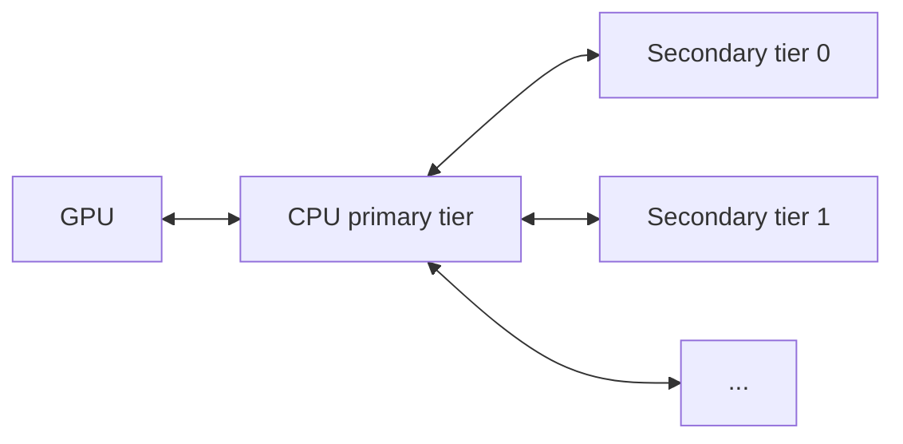

# KV Offloading Usage Guide

This guide covers configuration of the [`OffloadingConnector`](disagg_prefill.md), which extends the prefix cache by offloading completed KV blocks to slower but larger tiers (CPU host memory, plus optional secondary tiers) as they are produced. Hits in the offload tiers are promoted back to GPU on demand. Transfers between GPU and CPU use DMA (`cudaMemcpyAsync`) and run asynchronously alongside model computation, so offloading adds minimal CPU- and GPU-core overhead.

!!! note
    The `OffloadingConnector` currently supports CUDA, ROCm, and XPU only.

## Overview

Two specs are available, selected by the `spec_name` key in `kv_connector_extra_config`:

- `CPUOffloadingSpec` (default): single CPU tier. Completed GPU blocks are copied into pinned host memory.
- `TieringOffloadingSpec`: multi-tier. A CPU primary tier plus one or more secondary tiers.

Only the CPU primary tier has direct GPU access. Secondary tiers cannot read from or write to GPU memory; all GPU↔secondary transfers are staged through the CPU primary tier.



## Single-Tier Setup (CPU Only)

```bash
vllm serve <model> \
  --kv-transfer-config '{
    "kv_connector": "OffloadingConnector",
    "kv_role": "kv_both",
    "kv_connector_extra_config": {
      "block_size": 64,
      "cpu_bytes_to_use": 1000000000
    }
  }'
```

## Multi-Tier Setup

Set `spec_name` to `"TieringOffloadingSpec"` and supply a `secondary_tiers` list. Each entry is a dict with a required `type` key plus tier-specific fields (and an optional `module_path` for out-of-tree tiers). The list is ordered: tier 0 is consulted before tier 1, and so on. See [Secondary Tiers](#secondary-tiers) for tier-specific keys.

```bash
vllm serve <model> \
  --kv-transfer-config '{
    "kv_connector": "OffloadingConnector",
    "kv_role": "kv_both",
    "kv_connector_extra_config": {
      "spec_name": "TieringOffloadingSpec",
      "cpu_bytes_to_use": 10737418240,
      "block_size": 16,
      "eviction_policy": "lru",
      "secondary_tiers": [
        {
          "type": "fs",
          "root_dir": "/mnt/kv_cache",
          "n_read_threads": 32,
          "n_write_threads": 16
        }
      ]
    }
  }'
```

## `kv_connector_extra_config` Reference

| Key | Required | Default | Scope | Notes |
| --- | --- | --- | --- | --- |
| `spec_name` | no | `CPUOffloadingSpec` | both | Set to `TieringOffloadingSpec` for multi-tier. |
| `cpu_bytes_to_use` | yes | — | both | Total bytes of host memory reserved for the CPU tier across all workers (not per-worker). |
| `block_size` | no | GPU block size | both | Offloaded block size in tokens; must be a multiple of the GPU block size. Mutually exclusive with `blocks_per_chunk`. |
| `blocks_per_chunk` | no | `1` | both | Offloaded chunk size in GPU blocks; must be > 0. Alternative to `block_size` for models whose KV cache groups have different block sizes. |
| `eviction_policy` | no | `lru` | both | Primary tier policy: built-in `lru`/`arc`, or a custom `CachePolicy` name (see [Custom Eviction Policies](#custom-eviction-policies)). |
| `cache_policy_module_path` | no | — | both | Python import path for a custom `CachePolicy` not in the built-in registry. Required only when `eviction_policy` is not built-in and wasn't pre-registered via `CachePolicyFactory` (advanced). |
| `store_threshold` | no | `0` | single-tier | Min lookups before a block is offloaded. Values ≥ 2 are rejected by `TieringOffloadingSpec`. |
| `max_tracker_size` | no | `64000` | single-tier | Max entries in the lookup tracker. |
| `secondary_tiers` | no | `[]` | multi-tier | List of secondary tier configs (see below). |
| `offload_prompt_only` | no | `true` | both | If `true`, only prompt (prefill) blocks are offloaded; decode blocks are skipped. |
| `self_describing_kv_events` | no | `false` | both | Opt-in. When `true` *and* KV cache events are enabled (`--kv-events-config` with `enable_kv_cache_events`), the connector emits self-describing block-granular `BlockStored`/`BlockRemoved` payloads (constituent block hashes, whole-chunk `token_ids`, per-block `block_size`, parent hash, LoRA + group/cache-spec metadata) instead of the placeholder fallback, so external KV-event consumers can index offloaded blocks. Inert unless events are enabled. With `TieringOffloadingSpec`, a CPU promotion is self-describing when a local request observes its primary-tier `HIT` before event translation; otherwise its stored event may retain the placeholder, while a later `HIT` can backfill metadata for removal. Pending-removal/re-promotion races and externally initiated promotions may also produce placeholders, and consumers must ignore removals for unknown hashes. Partial recurrent tails emit the hash-aligned portion from the physical block start through the tail boundary. Other sliding-window/SSM chunks keep the placeholder fallback. In chunk mode (`block_size` > GPU block size, or `blocks_per_chunk` > 1), overlapping chunks re-announce shared per-block hashes, so consumers must reference-count (deduplicate) repeated store/remove announcements. |
| `spec_module_path` | no | — | both | Python import path for a custom `OffloadingSpec` not in the built-in registry. Required only when `spec_name` is not built-in (advanced). |

## Custom Eviction Policies

`eviction_policy` resolves through `CachePolicyFactory` (`vllm/v1/kv_offload/cpu/policies/factory.py`), which pre-registers the built-in `lru` and `arc` policies.

### Out-of-tree (recommended)

Implement `CachePolicy` (`vllm/v1/kv_offload/cpu/policies/base.py`) in your own package — no vLLM fork or patch required — and point `kv_connector_extra_config` at it directly:

```json
{
  "cpu_bytes_to_use": 10737418240,
  "eviction_policy": "MyCachePolicy",
  "cache_policy_module_path": "my_package.my_module"
}
```

`eviction_policy` is checked against the built-in registry first; if it isn't a registered name, vLLM imports `cache_policy_module_path` and looks up `eviction_policy` as a class name in that module — the same fallback `spec_module_path` provides for a custom `OffloadingSpec`. No import or registration call needs to run before the server starts.

### Registering a friendly short name (in-process only)

If you control the process that constructs the vLLM engine (e.g. an embedding application), you can register a short name once at startup instead of repeating the module path in every config:

```python
from vllm.v1.kv_offload.cpu.policies.factory import CachePolicyFactory

CachePolicyFactory.register_cache_policy("my_policy", "my_package.my_module", "MyCachePolicy")
```

Then set `"eviction_policy": "my_policy"` in `kv_connector_extra_config`, the same as `"lru"`/`"arc"`. This only takes effect within the process that ran the `register_cache_policy` call — it does not help when the server is launched as a separate process (e.g. via the `vllm serve` CLI), where the out-of-tree `cache_policy_module_path` config above is the only option.

## Secondary Tiers

Each entry in `secondary_tiers` is a dict with a required `type` field plus tier-specific fields.

The filesystem and object-store tiers can publish hash-only `BlockStored` KV events for blocks they successfully store, tagged with a stable per-tier `medium` (`FS` for the filesystem tier, `OBJ` for the object-store tier). Set `enable_kv_events: true` in the tier's entry to opt in; events are published only when KV cache events are also enabled globally via `--kv-events-config`.

Set the optional `locality` tier field to `LOCAL` or `REMOTE` to describe the tier's storage location relative to the publishing vLLM instance. `LOCAL` marks storage local to that instance, while `REMOTE` marks storage that is not local to it. When the setting is omitted, locality is unspecified. vLLM does not infer it from the tier type, so an OBJ tier is not implicitly `REMOTE`. A KV event includes `locality` only when the tier explicitly configures it. This metadata describes the tier property without implying that a consumer can already route requests to its blocks.

### MoRI UMBP

The MoRI tier (`type: "mori"`) uses UMBP as a distributed DRAM and optional
SSD pool. Install `amd-mori` with `BUILD_UMBP=ON`. For distributed mode, start
the packaged master before vLLM:

```bash
umbp_master 0.0.0.0:15558
```

Then configure UMBP as a secondary tier. The CPU primary tier is registered
once with MoRI, so batched puts and gets operate directly on its page buffers.

```bash
vllm serve <model> \
  --kv-transfer-config '{
    "kv_connector": "OffloadingConnector",
    "kv_role": "kv_both",
    "kv_connector_extra_config": {
      "spec_name": "TieringOffloadingSpec",
      "cpu_bytes_to_use": 68719476736,
      "secondary_tiers": [{
        "type": "mori",
        "dram_capacity_bytes": 34359738368,
        "master_address": "10.0.0.1:15558",
        "node_address": "10.0.0.2",
        "io_engine_port": 16000,
        "peer_service_port": 17000,
        "key_prefix": "vllm:kimi:",
        "eviction_policy": "prefix_aware_lru"
      }]
    }
  }'
```

Omit `master_address` for a standalone, node-local UMBP pool. In distributed
mode, `node_address`, `io_engine_port`, and `peer_service_port` must be
reachable by the other UMBP nodes. Ports must be unique for each local vLLM
process. `dram_capacity_bytes` is required and is the capacity contributed by
this process. Set `ssd_enabled`, `ssd_storage_dir`, and `ssd_capacity_bytes` to
add the local SSD tier. MoRI's `MORI_UMBP_*` and `UMBP_*` environment variables
remain available for lower-level transport and master tuning.

The tier starts with `UMBPConfig.from_environment()` and then applies explicit
JSON values, so per-tier configuration takes precedence. Production tuning
keys include:

| Key | Purpose |
| --- | --- |
| `dram_high_watermark` / `dram_low_watermark` | Bound DRAM eviction hysteresis. |
| `dram_use_hugepages` / `dram_hugepage_size` | Back the UMBP DRAM pool with huge pages. |
| `dram_numa_node` / `dram_prefault` | Bind and fault memory near the GPU/NIC. |
| `ssd_high_watermark` / `ssd_low_watermark` | Bound SSD eviction hysteresis. |
| `ssd_backend` / `ssd_segment_size_bytes` | Select `file`/`spdk` storage and segment size. |
| `copy_pipeline_worker_threads` | Parallel DRAM-to-SSD copy workers. |
| `copy_pipeline_queue_depth` | Maximum asynchronous SSD-copy backlog. |
| `copy_pipeline_batch_max_ops` | Maximum operations in one copy batch. |
| `cache_remote_fetches` | Cache remotely fetched blocks on the reader. |
| `cache_remote_admission` | Apply admission policy to remote fetch caching. |
| `dram_page_size` | Distributed DRAM allocation page size. |

The last three settings apply only when `master_address` enables distributed
mode. SPDK also requires MoRI to be built with its SPDK support and configured
for the target NVMe device.

In distributed mode, UMBP puts are admitted to a node's DRAM tier first and
then copied asynchronously to SSD. SSD capacity does not replace DRAM admission
capacity for a burst of new blocks. Size `dram_capacity_bytes` for the expected
write burst and allow for the master's heartbeat interval; otherwise route-put
requests can be rejected temporarily even while SSD has free space. Placement
updates are also heartbeat-driven, so a request sent immediately after a put
may precede the master's view of that block.

#### Placement event feed

UMBP can also index blocks that remain in vLLM-managed GPU or CPU caches. This
is the scheduler-visible path in the UMBP architecture. The bridge is a proxy:
it consumes vLLM's event stream, forwards it to a different endpoint, and
labels successful storage events as logical `UMBP` availability. Physical
node, locality, and DRAM/SSD tier remain unspecified because released MoRI does
not expose them through a read-only API. Enable vLLM's ZMQ KV events and run
the bridge before sending requests:

```bash
.venv/bin/python examples/features/kv_events/umbp_kv_event_bridge.py \
  --endpoint tcp://127.0.0.1:5557 \
  --output-endpoint 'tcp://*:5558' \
  --topic 'kv@<pod-name>@<model-name>' \
  --master-address 10.0.0.1:15558 \
  --node-id <the-tier-node-id> \
  --key-prefix vllm:kimi:
```

Add the publisher configuration to the vLLM command:

```bash
--kv-events-config '{
  "enable_kv_cache_events": true,
  "publisher": "zmq",
  "endpoint": "tcp://*:5557",
  "topic": "kv@<pod-name>@<model-name>"
}'
```

`node-id` must equal this process's UMBP tier `node_id` (or the vLLM engine ID
when `node_id` is omitted), and `key-prefix` must equal the tier's explicit
`key_prefix`. Configure llm-d to subscribe to the bridge output on port 5558,
not directly to vLLM on port 5557. Its placement TTL should be at least three
times the expected event delay. The bridge continues to register GPU/CPU
advisory placement and marks vLLM-observed storage events as UMBP. llm-d must
use deployment-calibrated UMBP restore cost rather than interpreting the event
as proof of a particular physical tier. Start the bridge before vLLM traffic
because the live stream does not replay events emitted before it subscribed.

To validate the distributed data and placement paths without GPUs, launch the
same-host two-replica harness against an unmodified MoRI build:

```bash
.venv/bin/python \
  examples/features/kv_events/validate_umbp_remote_placement.py \
  --master-bin /path/to/mori/build/src/umbp/umbp_master
```

The harness starts an ephemeral master and two clients, writes a deterministic
4 KiB payload before the second replica joins, reads it through that second
replica, compares every byte, and checks that vLLM emits logical `UMBP`
availability without fabricated physical hints. A successful run ends with:

```text
PASS: replica-b restored 4096 correct bytes from replica-a; availability=UMBP
```

This proves remote-read correctness and logical event integration. Because both
clients run on one host, it does not prove RDMA transport, NIC selection,
physical placement, or cross-node performance.

Routers can use `MoriPlacementClient.match(..., count_as_hit=True)` to query
which registered nodes hold a request's block hashes. The returned MoRI match
objects include the node ID, peer address, and matched hashes grouped by HBM,
DRAM, and SSD tier. Request dispatch based on those results belongs to the
deployment's router; vLLM's in-engine scheduler does not route between server
replicas.

#### Cache-aware routing proxy

The reference proxy turns those placement queries into request routing for
text-only completions and chat completions:

```bash
.venv/bin/python examples/online_serving/umbp_cache_aware_proxy.py \
  --model <tokenizer-or-model-path> \
  --base-model-name <served-model-name> \
  --master-address 10.0.0.1:15558 \
  --key-prefix vllm:kimi: \
  --hash-block-size 16 \
  --group-indices 0 \
  --replicas '[
    {"node_id":"replica-0","url":"http://10.0.0.2:8001"},
    {"node_id":"replica-1","url":"http://10.0.0.3:8001"}
  ]' \
  --port 8000
```

Each replica must use the same tokenizer, prefix-caching hash algorithm, hash
block size, and `key_prefix` as the proxy. Its UMBP tier `node_id` must match
the corresponding proxy entry. For a server that exposes multiple internal DP
ranks at one URL, add a separate entry per rank with `"dp_rank": N`; the proxy
sets `X-data-parallel-rank` on forwarded requests.

The proxy computes vLLM's chained full-block hashes, queries all configured KV
cache groups, and selects the replica with the longest consecutive cached
prefix. HBM, DRAM, and SSD matches break equal-length ties in that order. When
there is no placement match, it falls back to in-flight-aware round robin.
LoRA names and `cache_salt` are included in hashes. Requests with multimodal
message content, prompt embeddings, batched prompts, or custom server-side chat
template behavior fall back to load-aware routing because the proxy cannot
reconstruct their complete engine hash metadata safely.

`--hash-block-size` is the engine's prefix-hash block size, not necessarily the
offloading chunk size. `--hash-algorithm` must match
`--prefix-caching-hash-algo` and defaults to `sha256`. For hybrid cache models,
pass every event group index as a comma-separated list, for example
`--group-indices 0,1`. Keep the default byte-valued KV event hashes; legacy
integer event hashes are namespaced separately and cannot address UMBP data
entries created from full SHA-256 hashes.

### Filesystem (FS)

The filesystem tier (`type: "fs"`) writes blocks to a filesystem directory.

| Key | Required | Default | Notes |
| --- | --- | --- | --- |
| `type` | yes | — | Must be `fs`. |
| `root_dir` | yes | — | Base directory; vLLM creates subdirectories beneath it (see [On-Disk Layout](#on-disk-layout)). |
| `n_read_threads` | no | `16` | Read-priority I/O threads (load path). |
| `n_write_threads` | no | `16` | Write-priority I/O threads (store path). |
| `enable_kv_events` | no | `false` | Publish `BlockStored` KV events (medium `FS`) for successfully stored blocks. Requires KV cache events to be enabled globally. |
| `locality` | no | unspecified | `LOCAL` or `REMOTE` relative to the publishing vLLM instance. Included in the tier's KV events only when explicitly configured. |

Each thread group prefers its own queue but pulls from the other when its primary queue is empty, so a write-heavy or read-heavy burst won't leave the off-priority queue waiting. Size the totals to your storage's effective concurrency.

#### On-Disk Layout

Under `root_dir`, vLLM creates a subdirectory `<model>_<digest>`, where `<model>` is the model name with `/` replaced by `_` (so HuggingFace IDs like `meta-llama/Llama-3-8B` don't nest), and `<digest>` is a short SHA256 prefix derived from the run configuration (model, block size, parallelism, dtype, etc.). Runs with the same configuration share the same subdirectory; runs with different configurations live side-by-side under the same `root_dir` without colliding.

Inside that subdirectory, blocks are sharded across hash-prefix subdirectories to limit directory fan-out:

```text
<root_dir>/
  <model>_<digest>/
    config.json
  <model>_<digest>_r<rank>/
    <hhh>/                    # first 3 hex chars of the block hash
      <hh>_g<group_idx>/      # next 2 hex chars + KV cache group index
        <hash_hex>.bin        # full block hash (in hex)
```

`config.json` records the run (block size, number of KV groups, etc.) and is written on first start. Each rank writes blocks under its own `_r<rank>` sibling directory, so multiple ranks can safely share the same `root_dir`.

#### Cross-Process Sharing

KV cache sharing between multiple vLLM instances using the same `root_dir` (e.g., via a shared PVC) works by default: `NONE_HASH` (the chain-hash seed for block content hashes) is derived from a fixed default seed, so identical token content produces identical block filenames across instances. To use a custom shared seed instead, set the `PYTHONHASHSEED` environment variable to the same value on every instance.

The exception is the non-cryptographic `xxhash` and `xxhash_cbor` values of `--prefix-caching-hash-algo`, which seed `NONE_HASH` randomly per process so the seed stays unpredictable. Sharing a cache across instances with those algorithms requires setting the same `PYTHONHASHSEED` on every instance.

```bash
PYTHONHASHSEED=<shared-value> vllm serve ...
```

### Object Store (OBJ)

The object-store tier (`type: "obj"`) offloads blocks to an S3-compatible object store through the NIXL OBJ backend.

| Key | Required | Default | Notes |
| --- | --- | --- | --- |
| `type` | yes | — | Must be `obj`. |
| `store_config` | yes | — | Object store connection parameters (see below). |
| `prefix` | no | `""` | Key prefix prepended to all object keys. |
| `io_threads` | no | `4` | Number of NIXL OBJ backend I/O threads. |
| `enable_kv_events` | no | `false` | Publish `BlockStored` KV events (medium `OBJ`) for successfully stored blocks. Requires KV cache events to be enabled globally. |
| `locality` | no | unspecified | `LOCAL` or `REMOTE` relative to the publishing vLLM instance. Included in the tier's KV events only when explicitly configured; OBJ does not imply `REMOTE`. |

`store_config` fields:

| Key | Required | Default | Notes |
| --- | --- | --- | --- |
| `bucket` | yes | — | Bucket name. |
| `endpoint_override` | yes | — | Object store endpoint host; the URL scheme is set separately via `scheme`. |
| `scheme` | no | `http` | `http` or `https`. |
| `access_key`, `secret_key`, `session_token` | no | `""` | Explicit credentials. When left empty, the NIXL OBJ plugin falls back to the AWS SDK default credential provider chain (IAM roles, environment variables, credential files), which enables workload-identity auth on Kubernetes. |
| `region` | no | `""` | Bucket region, if the endpoint requires one. |
| `ca_bundle` | no | `""` | CA bundle path for TLS verification. |

Object keys follow the same run-configuration digest scheme as the filesystem tier (see [On-Disk Layout](#on-disk-layout)) and are stored under the optional `prefix`. The [Cross-Process Sharing](#cross-process-sharing) behavior applies to shared buckets as well, so instances sharing a bucket produce identical keys for identical content; set a shared `PYTHONHASHSEED` if you want a custom seed. At startup the tier probes object store connectivity and fails fast with a configuration error if the bucket is unreachable.

### P2P (Including P/D)

The P2P tier (`type: "p2p"`) shares completed KV blocks between vLLM instances over RDMA via NIXL. Each instance binds a control socket on `host:port` and exchanges blocks directly with peers — no shared filesystem required.

Block content hashes must match across instances for peers to exchange blocks (see [Cross-Process Sharing](#cross-process-sharing)). This works by default via the deterministic `NONE_HASH` seed, so setting `PYTHONHASHSEED` is optional. If you do set it, it must be the same value on all nodes. Each peer's effective seed is verified during the connect handshake — a peer advertising a different seed is rejected. With the `xxhash`/`xxhash_cbor` algorithms the seed is random per process, so `PYTHONHASHSEED` must be set on every peer or the handshake rejects them.

| Key | Required | Default | Notes |
| --- | --- | --- | --- |
| `type` | yes | — | Must be `p2p`. |
| `host` | no | `$VLLM_P2P_SIDE_CHANNEL_HOST` (`localhost`) | Address the control socket binds to, used verbatim as the identity peers dial back. When omitted, resolves from the env var below. The `localhost` default binds loopback only — for cross-host P2P you **must** set it to the node's routable IP (see below). |
| `port` | no | `$VLLM_P2P_SIDE_CHANNEL_PORT` (`5710`) | Base port for the control socket. Must be reachable from peers. The bound port is `base + data_parallel_index` (one socket per DP replica). When omitted, the base resolves from the env var below. |
| `backends` | no | `["UCX"]` | NIXL transport backends. See [NixlConnector Usage Guide](nixl_connector_usage.md#selecting-a-nixl-transport-backend-plugin) for available backends and selection guidance. |
| `num_threads` | no | `4` | NIXL agent worker threads. Only used when `backends` is UCX-only; ignored when any non-UCX backend is requested. |

The `backends` and `num_threads` options mirror the conditional logic used by [`NixlConnector`](nixl_connector_usage.md#selecting-a-nixl-transport-backend-plugin): when any non-UCX backend is configured, NIXL is initialised with `backends=...`; otherwise it falls back to a UCX-only agent with the configured `num_threads`. This lets the P2P tier use a different transport (e.g. `MOONCAKE`, `GDS_MT`, `LIBFABRIC`) than the main `NixlConnector` running in the same process.

#### Environment Variables

Rather than embedding `host`/`port` in each `secondary_tiers` entry, set them once at deploy time via environment variables (mirroring `VLLM_NIXL_SIDE_CHANNEL_HOST`/`VLLM_NIXL_SIDE_CHANNEL_PORT`). Explicit `host`/`port` config keys, when present, take precedence.

- `VLLM_P2P_SIDE_CHANNEL_HOST` (default `localhost`): address the P2P control socket binds to. It is used **verbatim** as both the bind address and the identity peers dial back — there is no auto-detection (this mirrors `VLLM_NIXL_SIDE_CHANNEL_HOST`). The default binds the loopback interface only, so peers on another host cannot reach it. **For any cross-host P2P deployment you must set this explicitly to the node's routable IP** (e.g. the pod IP) before launching `vllm serve` — otherwise remote peers will fail to connect. The NIXL agent name is a separate per-process identifier, so peers sharing a `host:port` never collide.
- `VLLM_P2P_SIDE_CHANNEL_PORT` (default `5710`): base port for the P2P control socket. The port actually bound is `VLLM_P2P_SIDE_CHANNEL_PORT + data_parallel_index` — one socket per DP replica, matching NIXL (for DP=1 the offset is 0). The peer's port is passed as `remote_port` in `kv_transfer_params`; the router/EPP that selects the DP rank (e.g. via the `X-data-parallel-rank` header) computes `remote_port = base + rank`. The DP-index offset separates replicas *within* one deployment; two co-located *deployments* (a prefiller and a decoder on the same host) still need distinct base ports (e.g. decoder base `5711`) to avoid a bind collision.

#### Orchestration-Layer Protocol

The P2P tier does not decide *which* peer to pull from — that is the orchestration layer's job (the router/EPP and its scheduler). The orchestrator drives every transfer through a request's `kv_transfer_params` dict: it picks the request's role, allocates a unique transaction ID, and supplies the remote peer's address. All block lookup, hash matching, and NIXL transfer happen at the tier level below; the orchestrator only sets the correct role keys and enforces the allowed combinations.

Every vLLM instance is a symmetric **peer**. Per request it acts as a **consumer** (pulls KV blocks from a remote peer's CPU cache instead of computing locally) or a **producer** (serves blocks from its own CPU cache to remote consumers) — or both, on the same session, for different requests. Roles are chosen per request by the keys below; there are no fixed prefiller/decoder processes.

Three role keys are defined, each mapping to a sub-dict. All are optional; a request with none of them uses the tier only as a local CPU cache.

Each key names the **remote counterpart** this peer transfers with (not this
peer's own role), so the name reads as "the remote ___ I transfer with".

| Key | Set on | Value fields | Meaning |
| --- | --- | --- | --- |
| `remote_decoder` | prefill producer request | `kv_request_id` | Peer computes KV and keeps it available in CPU cache for the remote decoder to pull. |
| `remote_prefiller` | decode consumer request | `kv_request_id`, `remote_host`, `remote_port` | Peer pulls KV from the remote prefiller at the given address (classic P/D disaggregation). |
| `remote_kv_source` | P2P consumer request | `kv_request_id`, `remote_host`, `remote_port` | Peer looks up and pulls whatever blocks the remote source currently holds in CPU cache. |

Field semantics:

- `kv_request_id` (str): unique transaction ID allocated by the orchestrator and pushed to every peer involved in the transfer; used to correlate the lookup, fetch, and transfer-done messages. The producer is implicit — it serves whatever block hashes it currently holds in its CPU cache for that ID.
- `remote_host` (str): IP/hostname of the remote peer's control socket to query. Must be the peer's routable node IP (see [Environment Variables](#environment-variables)).
- `remote_port` (int): the peer's bound control-socket port, i.e. `base + data_parallel_index` for the selected DP rank.

Allowed and forbidden combinations:

- **`remote_decoder` + `remote_kv_source`** is the only legal multi-key combination: a prefill producer may *also* act as a P2P consumer for the same request — skipping prefix prefill by pulling cached blocks from a source while still keeping its own computed blocks available for a downstream decoder.
- Forbidden: `remote_prefiller` + `remote_decoder` (contradictory roles), `remote_prefiller` + `remote_kv_source` (two competing fetch sources), and all three together.

Minimal examples (values that would appear in the request's `kv_transfer_params`):

```python
# Prefill producer — compute and keep KV for a remote decoder to pull
kv_transfer_params = {"remote_decoder": {"kv_request_id": "<unique-transfer-id>"}}

# Decode consumer — pull KV from a specific prefiller (classic P/D)
kv_transfer_params = {
    "remote_prefiller": {
        "kv_request_id": "<unique-transfer-id>",
        "remote_host": "<prefiller-node-ip>",
        "remote_port": 5710,
    }
}

# P2P consumer — pull whatever the source already has cached
kv_transfer_params = {
    "remote_kv_source": {
        "kv_request_id": "<unique-transfer-id>",
        "remote_host": "<source-node-ip>",
        "remote_port": 5710,
    }
}
```

Runtime handshake for a P2P (or P/D) pull, once the orchestrator has set the keys above:

1. Both peers already have listener threads on their control sockets (see [Environment Variables](#environment-variables)).
2. **Lookup.** The consumer's tiering manager does per-block lookups; in P2P mode the tier returns `None` and registers the key. At `on_schedule_end` the consumer sends one **`LookupMsg`** (`kv_request_id` + block hashes) to the peer, per request, per step.
3. The producer matches those hashes against its local CPU cache and replies with a **`LookupRespMsg`** carrying the hit block hashes.
4. **Resolve.** Retried lookups now return hit / miss / in-flight. The consumer calls `submit_load` for hits only, allocating CPU slots only for hits.
5. The consumer sends a **`FetchMsg`** (`kv_request_id`, block hashes, destination block indexes).
6. The producer performs the **NIXL WRITE** transfer and sends **`TransferDone`** with a success status.
7. On `get_finished`, hits are loaded into GPU as ordinary cache hits; misses are recomputed by the engine.

In classic **P/D mode** (`remote_prefiller` set, no `remote_kv_source`), the lookup phase (steps 2–4) is skipped: the decode consumer assumes the prefiller holds all of the request's blocks, so every block `lookup()` returns an immediate hit and the consumer jumps straight to the **`FetchMsg`** in step 5. The `LookupMsg`/`LookupRespMsg` round-trip only happens in P2P mode, where the consumer does not know in advance which blocks the peer has cached.

### Out-of-Tree Secondary Tiers

Implement `SecondaryTierManager` (`vllm/v1/kv_offload/tiering/base.py`) in your own package — no vLLM fork or patch required — and point the tier config at it directly:

```json
{
  "spec_name": "TieringOffloadingSpec",
  "cpu_bytes_to_use": 10737418240,
  "secondary_tiers": [
    {
      "type": "MyCustomTier",
      "module_path": "my_package.my_module",
      "custom_param": "value"
    }
  ]
}
```

`type` is checked against the built-in registry first; if it isn't a registered name, vLLM imports `module_path` and looks up `type` as a class name in that module.

## Tuning Tips

- `cpu_bytes_to_use`: a bigger CPU tier means fewer trips to slower secondary tiers and a higher hit rate. The value is total across all workers, not per-worker. Leave headroom for the rest of the host workload.
- For single-tier (CPU-only) setups, set `cpu_bytes_to_use` larger than the aggregate GPU KV cache. Because offloading is immediate, a smaller CPU tier just mirrors what the GPU already holds and adds no hit rate.
- `block_size` / `blocks_per_chunk`: larger offloaded chunks reduce per-block bookkeeping overhead but increase the granularity of lookups.
- FS thread counts: tune `n_read_threads` and `n_write_threads` to the parallelism your storage can sustain. Reads are latency-sensitive on the prefill path, so prefer more read threads when prefill hit rates are high.
- Sharing `root_dir` across runs: runs with the same model, `block_size`, parallelism layout, and dtype share files under the same `<digest>` subdirectory. Changing any of these produces a new subdirectory; old ones are orphaned but harmless. Delete them to reclaim disk.

## Per-Request Selective Offload

Individual requests can cap how many of their tokens are eligible for offload by setting `max_offload_tokens` in the request's `kv_transfer_params`. Only the first `max_offload_tokens` tokens of the request are offloaded; blocks beyond that point are skipped on the store path. This is useful when a known prefix (e.g., a system prompt or shared context) is worth caching but later request-specific tokens are not.

| Key | Type | Notes |
| --- | --- | --- |
| `max_offload_tokens` | non-negative `int` | Upper bound on tokens to offload for this request. `0` disables offload for the request entirely; omit the key (or set to `None`) for no cap. Non-`int`, negative, or `bool` values are rejected with a warning and treated as no cap. |

!!! note
    `max_offload_tokens` is experimental and subject to change.

Example (OpenAI-compatible completions request):

```json
{
  "model": "<model>",
  "prompt": "...",
  "kv_transfer_params": {
    "max_offload_tokens": 1024
  }
}
```

## Scheduler-aware loadback prefetch

Set `target_tier` to `"gpu"` to preload a token prefix into the normal HBM
prefix cache before admitting the real request:

```json
{
  "version": "v1",
  "prefetch_id": "route-42",
  "model": "Qwen/Qwen3-0.6B",
  "prompts": [[1, 2, 3, 4]],
  "target_tier": "gpu"
}
```

The engine admits an internal, non-executing request, loads matching blocks
through the configured KV connector, publishes them in the ordinary prefix
cache, and releases the request's references. Poll until the result is
`ready`, `partial`, or `miss`. This guarded first implementation accepts one
token-only prompt and an optional cache salt. LoRA and multimodal identities
remain supported for CPU-targeted prefetch only.

An external scheduler can initiate CPU-tier loadback before forwarding the
normal inference request:

```text
POST   /v1/kv_cache/prefetch
GET    /v1/kv_cache/prefetch/{prefetch_id}
DELETE /v1/kv_cache/prefetch/{prefetch_id}
```

The start body contains `version: "v1"`, a unique `prefetch_id`, the served
`model`, tokenized `prompts`, optional `cache_salt`, optional `lora_name`,
per-prompt `multimodal_features`, and `target_tier: "cpu"`. Each multimodal
feature contains its raw content `hash`, placeholder `offset`, and `length`.
vLLM derives its own cache hashes and tower-LoRA identifiers; callers must not
send router-local block hashes.

The llm-d `umbp-prefetch` plugin forwards multimodal identities directly. It
sets `lora_name` only through its explicit `loraModels` map from routed model
name to vLLM LoRA name. Do not infer this mapping from model-name syntax: a
false LoRA identity produces a safe miss but defeats prefetch reuse.

The following top-level `kv_connector_extra_config` keys bound scheduler-side
prefetch state:

| Key | Default | Purpose |
| --- | --- | --- |
| `prefetch_max_pending_requests` | `64` | Maximum simultaneous pending prefetches. |
| `prefetch_max_pending_blocks` | `4096` | Maximum summed block references across pending prefetches. |
| `prefetch_max_pending_gpu_bytes` | GPU KV capacity | Maximum HBM bytes reserved by pending GPU-targeted prefetches. |
| `prefetch_pending_ttl_seconds` | `30` | Cancel and discard abandoned pending work. |
| `prefetch_terminal_ttl_seconds` | `60` | Retain ready/miss/cancelled results for idempotent retries. |

Admission-limit failures return HTTP 409. The router should fall back to
ordinary request forwarding and recomputation. These limits bound control
state and promoted block references; normal CPU-tier watermarks remain the
authoritative byte-capacity limit.

## Further Reading

- [vLLM blog: KV Offloading Connector](https://vllm.ai/blog/2026-01-08-kv-offloading-connector) — motivation, architecture (DMA-based async transfer), and benchmarks (TTFT and throughput).
